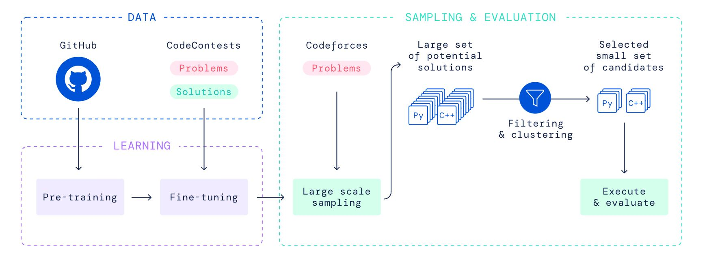

## Do you know AlphaCode?
Programming has been for a long time a high-status, high-demand skill. With various programming language that exist up to this date, AI companies was driven to explore the possibilities of systems that can learn to code. The first notable AI system that able to do it is OpenAI's Codex. It can generate a simple code that matches the user's intention. But, Codex only able to solve easy tasks which did not meet the need of real-world programming that full of complexity. This AI models lack of problem solving skills. As part of DeepMind's mission to solve intelligence, they want to fill the gap by introducing AlphaCode, an AI system that has been trained to understand natural language, design algorithms to solve problems, and implement them into code.

## Overview of AlphaCode
1. `Pre-training`: AlphaCode is a transformer-base large language model initially trained on GitHub code repositories.
2. `Fine-tuning`: to fine-tune and specialize AlphaCode, DeepMind created a programming dataset named CodeContests.
3. `Generation`: For each Codeforces problem, AlphaCode generates up to a million samples.
4. `Filtering and clustering`: The samples are filtered by evaluating them on visible test cases. After that, they cluster the remaining samples depending on their outputs to custom test cases. Last, they will select candidates for evaluation.

> source : https://www.deepmind.com/blog/competitive-programming-with-alphacode

## References
1. https://www.deepmind.com/blog/competitive-programming-with-alphacode
2. https://towardsdatascience.com/deepminds-alphacode-explained-everything-you-need-to-know-5a86a15e1ab4
3. https://towardsdatascience.com/heres-how-openai-codex-will-revolutionize-programming-and-the-world-e8432aafc5f7