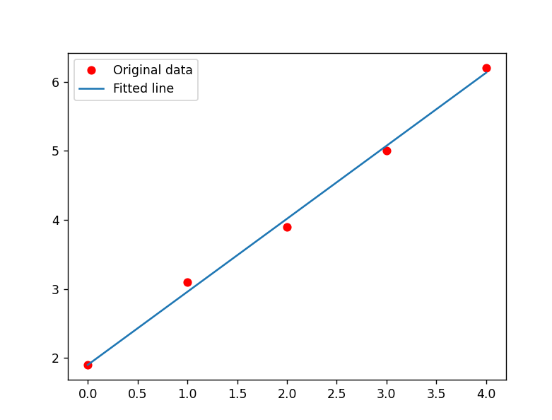

# Hill Climbing Algorithm
Hill climbing is one of mathematical optimization algorithm. Its purpose is to find the best solution to a problem with a lot of possible solutions. At first Hill climbing would generate neighbours, it then will compare between those neighbours and current solution. If neighbours is better than current solution, it will replace the current solution with the better solution. It then keep repeats the pattern until there is no further improvements.

## Applied Hill Climbing to Linear Regression
Hill climbing solution can be aplied to linear regression. For example, if we have several scalar data we can use hill climbing to find the best linear approach for modelling the relationship between a scalar.

For example if we have five points `(0, 1.9), (1, 3.1), (2, 3.9), (3, 3.9), (4, 6.2)` which if I write it in my code as array it would be like this:

```python
x = np.array([0,1,2,3,4], dtype=np.float32)
y = np.array([1.9, 3.1, 3.9, 5.0, 6.2], dtype = np.float32)
```

My approach start with drawing a line from the first point `(0, 1.9)` to the last point `(4, 6.2)`. I also create the similar function and named it as neighbour, later I will compare the accuracy between this two function.

```python
#For the first input l1=(0, 1.9) l2=(4, 6.2)
def neighbour(l1,l2,dataX,dataY,b):
    m, c = find_ab(l1, l2)
    err_Score = 0
    if b < 0:
        state = "down"
    else:
        state = "up"

    for i in range(0, len(dataX)):
        y_line = dataX[i] * m + c
        err_Score = err_Score + (y_line - dataY[i])**2
    print("--nb {:s} m:{:.3f} c:{:.3f} err_Score:{:.3f}".format(state, m, c, err_Score))
    print("l1:{:.3f}, {:.3f} | l2[1]:{:.3f}, {:.3f}".format(l1[0],l1[1],l2[0],l2[1]))
    print("m:{:.3f}, c:{:.3f}".format(m,c))
    print("err_Score:{:.5f}\n".format(err_Score))
    return m, c, err_Score

def hillClimbing(l1,l2,dataX,dataY,state=0):
    print("--current")
    m, c = find_ab(l1, l2)
    err_Score = 0
    for i in range(0, len(dataX)):
        y_line = dataX[i] * m + c
        print("y_line:{:.3f}, {:.3f} * {:.3f} + {:.3f}".format(y_line,dataX[i],m,c))
        err_Score = err_Score + (y_line - dataY[i])**2
    print("l1:{:.3f}, {:.3f} | l2[1]:{:.3f}, {:.3f}".format(l1[0],l1[1],l2[0],l2[1]))
    print("m:{:.3f}, c:{:.3f}".format(m,c))
    print("err_Score:{:.5f}\n".format(err_Score))

    if state != -1:
        mUp, cUp, errUp = neighbour(l1,(l2[0],l2[1]+0.01),dataX,dataY,1)
    if state != 1:
        mDown, cDown, errDown = neighbour(l1,(l2[0],l2[1]-0.01),dataX,dataY,-1)

    if err_Score == 0:
        return m, c, err_Score
    #Compare with its neighbour
    elif state != -1 and errUp <= err_Score and errUp < errDown:
        godown = False
        print("go up")
        return hillClimbing(l1,(l2[0],l2[1]+0.01),dataX,dataY,1)
    elif state != 1 and errDown <= err_Score:
        print("go down")
        goup = False
        return hillClimbing(l1,(l2[0],l2[1]-0.01),dataX,dataY,-1)
    else:
        return m, c, err_Score
```

As you can see from the code above I use `state` variable to devine the direction of my current point. So, for example if it went down then it would not compare the current data with the last data.

To know the solution accuracy, I count the total distance between each of my predicted y point with the original y point.

```python
def neighbour(l1,l2,dataX,dataY,b):
    ...
    for i in range(0, len(dataX)):
        y_line = dataX[i] * m + c
        err_Score = err_Score + (y_line - dataY[i])**2
    ...

def hillClimbing(l1,l2,dataX,dataY,state=0):
    ...
    for i in range(0, len(dataX)):
        y_line = dataX[i] * m + c
        print("y_line:{:.3f}, {:.3f} * {:.3f} + {:.3f}".format(y_line,dataX[i],m,c))
        err_Score = err_Score + (y_line - dataY[i])**2
    ...
```

If the neighbour `err_Score` or loss is smaller than current data, then my program will set it as the current data and do the comparation with its neighbour again. It will keep repeating until the current data is better than any of its neighbours.

I also use pyplot to draw the graphic result

```python
# Plot the graph
y_predicted = list(map(lambda t: p[0]+p[1]*t, x))
print('y_predicted=', y_predicted)
plt.plot(x, y, 'ro', label='Original data')
plt.plot(x, y_predicted, label='Fitted line')
plt.legend()
plt.show()
```

Below is the output from running my program:
<details><summary>terminal output</summary>

```
> python "(1)HillClimbing_LR.py"
--current
y_line:1.900, 0.000 * 1.075 + 1.900
y_line:2.975, 1.000 * 1.075 + 1.900
y_line:4.050, 2.000 * 1.075 + 1.900
y_line:5.125, 3.000 * 1.075 + 1.900
y_line:6.200, 4.000 * 1.075 + 1.900
l1:0.000, 1.900 | l2[1]:4.000, 6.200
m:1.075, c:1.900
err_Score:0.05375

--nb up m:1.077 c:1.900 err_Score:0.057
l1:0.000, 1.900 | l2[1]:4.000, 6.210
m:1.077, c:1.900
err_Score:0.05669

--nb down m:1.072 c:1.900 err_Score:0.051
l1:0.000, 1.900 | l2[1]:4.000, 6.190
m:1.072, c:1.900
err_Score:0.05119

go to down
--current
y_line:1.900, 0.000 * 1.072 + 1.900
y_line:2.972, 1.000 * 1.072 + 1.900
y_line:4.045, 2.000 * 1.072 + 1.900
y_line:5.117, 3.000 * 1.072 + 1.900
y_line:6.190, 4.000 * 1.072 + 1.900
l1:0.000, 1.900 | l2[1]:4.000, 6.190
m:1.072, c:1.900
err_Score:0.05119

--nb down m:1.070 c:1.900 err_Score:0.049
l1:0.000, 1.900 | l2[1]:4.000, 6.180
m:1.070, c:1.900
err_Score:0.04900

go to down
--current
y_line:1.900, 0.000 * 1.070 + 1.900
y_line:2.970, 1.000 * 1.070 + 1.900
y_line:4.040, 2.000 * 1.070 + 1.900
y_line:5.110, 3.000 * 1.070 + 1.900
y_line:6.180, 4.000 * 1.070 + 1.900
l1:0.000, 1.900 | l2[1]:4.000, 6.180
m:1.070, c:1.900
err_Score:0.04900

--nb down m:1.067 c:1.900 err_Score:0.047
l1:0.000, 1.900 | l2[1]:4.000, 6.170
m:1.067, c:1.900
err_Score:0.04719

go to down
--current
y_line:1.900, 0.000 * 1.067 + 1.900
y_line:2.967, 1.000 * 1.067 + 1.900
y_line:4.035, 2.000 * 1.067 + 1.900
y_line:5.102, 3.000 * 1.067 + 1.900
y_line:6.170, 4.000 * 1.067 + 1.900
l1:0.000, 1.900 | l2[1]:4.000, 6.170
m:1.067, c:1.900
err_Score:0.04719

--nb down m:1.065 c:1.900 err_Score:0.046
l1:0.000, 1.900 | l2[1]:4.000, 6.160
m:1.065, c:1.900
err_Score:0.04575

go to down
--current
y_line:1.900, 0.000 * 1.065 + 1.900
y_line:2.965, 1.000 * 1.065 + 1.900
y_line:4.030, 2.000 * 1.065 + 1.900
y_line:5.095, 3.000 * 1.065 + 1.900
y_line:6.160, 4.000 * 1.065 + 1.900
l1:0.000, 1.900 | l2[1]:4.000, 6.160
m:1.065, c:1.900
err_Score:0.04575

--nb down m:1.062 c:1.900 err_Score:0.045
l1:0.000, 1.900 | l2[1]:4.000, 6.150
m:1.062, c:1.900
err_Score:0.04469

go to down
--current
y_line:1.900, 0.000 * 1.062 + 1.900
y_line:2.962, 1.000 * 1.062 + 1.900
y_line:4.025, 2.000 * 1.062 + 1.900
y_line:5.087, 3.000 * 1.062 + 1.900
y_line:6.150, 4.000 * 1.062 + 1.900
l1:0.000, 1.900 | l2[1]:4.000, 6.150
m:1.062, c:1.900
err_Score:0.04469

--nb down m:1.060 c:1.900 err_Score:0.044
l1:0.000, 1.900 | l2[1]:4.000, 6.140
m:1.060, c:1.900
err_Score:0.04400

go to down
--current
y_line:1.900, 0.000 * 1.060 + 1.900
y_line:2.960, 1.000 * 1.060 + 1.900
y_line:4.020, 2.000 * 1.060 + 1.900
y_line:5.080, 3.000 * 1.060 + 1.900
y_line:6.140, 4.000 * 1.060 + 1.900
l1:0.000, 1.900 | l2[1]:4.000, 6.140
m:1.060, c:1.900
err_Score:0.04400

--nb down m:1.057 c:1.900 err_Score:0.044
l1:0.000, 1.900 | l2[1]:4.000, 6.130
m:1.057, c:1.900
err_Score:0.04369

go to down
--current
y_line:1.900, 0.000 * 1.057 + 1.900
y_line:2.957, 1.000 * 1.057 + 1.900
y_line:4.015, 2.000 * 1.057 + 1.900
y_line:5.072, 3.000 * 1.057 + 1.900
y_line:6.130, 4.000 * 1.057 + 1.900
l1:0.000, 1.900 | l2[1]:4.000, 6.130
m:1.057, c:1.900
err_Score:0.04369

--nb down m:1.055 c:1.900 err_Score:0.044
l1:0.000, 1.900 | l2[1]:4.000, 6.120
m:1.055, c:1.900
err_Score:0.04375

=== FINAL SOLUTION ===
solution: m=1.057500 c=1.900000
loss= 0.04368742328888642
y_predicted= [1.899999976158142, 2.957499934434891, 4.01499989271164, 5.07249985098839, 6.129999809265138
```
</details>
<br>
<p>Graphic:</p>


For the full code please refer to this [link](https://github.com/NubletZ/ai110b/tree/master/Homework/HillClimbing).

---

## Reference
https://towardsdatascience.com/how-to-implement-the-hill-climbing-algorithm-in-python-1c65c29469de

https://www.javatpoint.com/hill-climbing-algorithm-in-ai