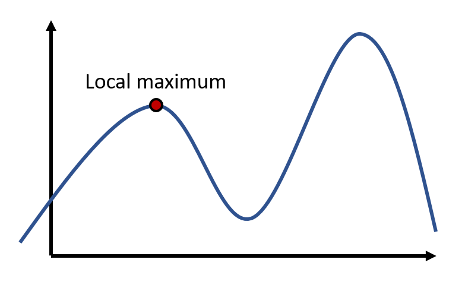
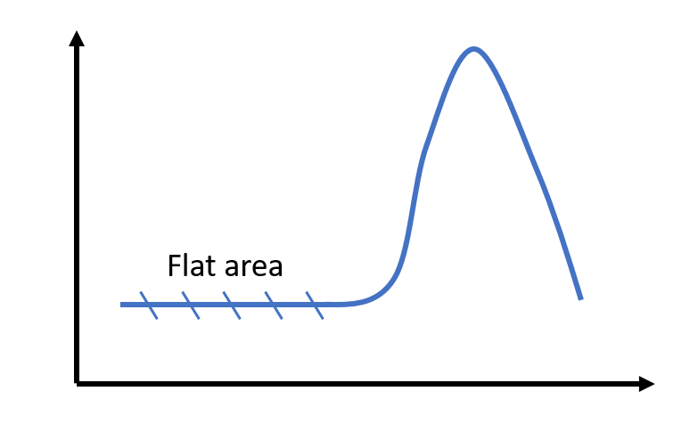
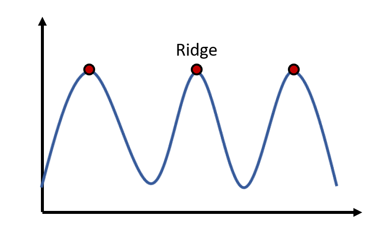

## Problems in Hill Climbing
There are several problem in applying hill climbing algorithm

### 1. Local maximum
The first problem is when there is exist a local maximum. A local maximum is a peak state in the landscape which is better than each of its neighboring states, but there is present another state that is higher than the local maximum.

<br>

### 2. Plateau
Plateau is the flate area of the search space where all the neighbor states from the current state have the same value, as the result this algorithm could not find any better direction to move.

<br>

### 3. Ridge
A ridge is a condition in which there are several peaks with all have the same value, or in other words, there are multiple local maxima which are the same as global maximal

<br>

To solve those problems, we can try to take several random point and applied hill climbing algorithm for each point. Let's tried to apply this to solve the traveling salesman problem. I will use the data of 17 cities. Because I put the data in a file, so I need to write a function to read that file and convert it into a list in Python :

```python
def readFile(path):
    tsp = []
    row = []

    with open(path) as f:
        line = f.readline()
        firstLine = re.split('[-_\s]+', line)
        for data in firstLine:
            if data != '':
                row.append(int(data))
        tsp.append(row)
        while line:
            row = []
            line = f.readline()
            n = len(line)
            if n > 0:   
                datas = re.split('[-_\s]+', line)
                for data in datas:
                    if data != '':
                        row.append(int(data))
                tsp.append(row)
        return tsp
```

After that we need to write the hill climbing code to find the shortest distance to travel all 17 cities. We start by generating a random solution and then compare it with its neighbours.

```python
def randomSolution(tsp):
    cities = list(range(len(tsp)))
    solution = []

    for i in range(len(tsp)):
        randomCity = cities[random.randint(0, len(cities) - 1)]
        solution.append(randomCity)
        cities.remove(randomCity)

    return solution

def routeLength(tsp, solution):
    routeLength = 0
    for i in range(len(solution)):
        routeLength += tsp[solution[i - 1]][solution[i]]
    return routeLength

def getNeighbours(solution):
    neighbours = []
    for i in range(len(solution)):
        for j in range(i + 1, len(solution)):
            neighbour = solution.copy()
            neighbour[i] = solution[j]
            neighbour[j] = solution[i]
            neighbours.append(neighbour)
    return neighbours

def getBestNeighbour(tsp, neighbours):
    bestRouteLength = routeLength(tsp, neighbours[0])
    bestNeighbour = neighbours[0]
    for neighbour in neighbours:
        currentRouteLength = routeLength(tsp, neighbour)
        if currentRouteLength < bestRouteLength:
            bestRouteLength = currentRouteLength
            bestNeighbour = neighbour
    return bestNeighbour, bestRouteLength

def hillClimbing(tsp):
    currentSolution = randomSolution(tsp)
    currentRouteLength = routeLength(tsp, currentSolution)
    neighbours = getNeighbours(currentSolution)
    bestNeighbour, bestNeighbourRouteLength = getBestNeighbour(tsp, neighbours)
    while bestNeighbourRouteLength < currentRouteLength:
        currentSolution = bestNeighbour
        currentRouteLength = bestNeighbourRouteLength
        neighbours = getNeighbours(currentSolution)
        bestNeighbour, bestNeighbourRouteLength = getBestNeighbour(tsp, neighbours)
    return currentSolution, currentRouteLength
```

Last we need to write the main function as the program flow, in this function we will do hill climbing for several random point:

```python
def main():
    tsp = readFile('./tsp_d.txt')
    step = 0
    limit = 1000
    bestData = hillClimbing(tsp)
    best = 2085
    while bestData[1] != best and step <= limit:
        nextStep = hillClimbing(tsp)
        if nextStep[1] < bestData[1]:
            bestData = nextStep
        step += 1
        print(f'{step}:Length = {bestData[1]}')
    if step > 1000:
        print("already exceed the limit")
    print(f'best data = {bestData} step = {step}')

if __name__ == "__main__":
    start_time = time.time()
    main()
    print("--- %s seconds ---" % (time.time() - start_time))
```
From the code above we set the first local maximum as the best data. After that it will enter the while loop to do the comparison between local maximum points until it reach the targeted value or it has exceeded the loop limit.

The above code will show output that looks like this :

```
$ python TSP.py

1:Length = 2365
2:Length = 2214
3:Length = 2163
4:Length = 2156
5:Length = 2156
6:Length = 2153
7:Length = 2153
8:Length = 2085
best data = ([14, 13, 16, 5, 7, 6, 12, 3, 0, 15, 11, 8, 4, 1, 9, 10, 2], 2085) step = 8
--- 0.1110076904296875 seconds ---
```

I have run the program for 10 times and got the average time 0.38s to get the best solution for 17 cities.

For the full code, please refer to this [page](https://github.com/NubletZ/ai110b/blob/master/Homework/TSP_Problem/TSP.py).

## Reference

https://towardsdatascience.com/how-to-implement-the-hill-climbing-algorithm-in-python-1c65c29469de