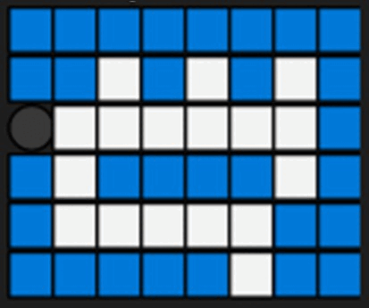

## Depth First Search (DFS) Algorithm
Depth first search (DFS) algorithm is an algorithm for traversing or searching tree or graph data structures. It will start with the initial node of the graph, and then goes deeper until it reach the end node, before it then backtracks to the most recent unexplored node.

We can apply this algorithm to solve maze problem. For example if we have a mouse that would walk through the maze as shown below, where `🟦 is the wall`, `⬜ is the path`, and `⚫ is the mouse path`

```
🟦🟦🟦🟦🟦🟦🟦🟦
🟦🟦⬜🟦⬜🟦⬜🟦
⚫⬜⬜⬜⬜⬜⬜🟦
🟦⬜🟦🟦🟦🟦⬜🟦
🟦⬜⬜⬜⬜⬜🟦🟦
🟦🟦🟦🟦🟦⬜🟦🟦
```

Then we can write a code that will check for the surrounding path, and put the unvisited path into the stack. In python it will be written like this:

```python
maze = [[1,1,1,1,1,1,1,1], 
        [1,1,0,1,0,1,0,1],
        [0,0,0,0,0,0,0,1],
        [1,0,1,1,1,1,0,1],
        [1,0,0,0,0,0,1,1],
        [1,1,1,1,1,0,1,1]]

start_point = [2,0]
end_point = [5,5]
visited = []
unvisited = []
mazeLenI = 6
mazeLenJ = 8

def findRoute(i, j):
        maze[i][j] = 2
        printMap()
        if i == 5 and j == 5:
                print(f'Finish point = {i}, {j}')
                return i, j
        else:
                if i-1 >= 0:
                        if maze[i-1][j] == 0:
                                unvisited.append([i-1,j])
                if i+1 < mazeLenI:
                        if maze[i+1][j] == 0:
                                unvisited.append([i+1,j])
                if j+1 < mazeLenJ:
                        if maze[i][j+1] == 0:
                                unvisited.append([i,j+1])
                if j-1 >= 0:
                        if maze[i][j-1] == 0:
                                unvisited.append([i,j-1])
                if len(unvisited) > 0:
                        nextPos = unvisited.pop()
                        print(f'unvisited = {unvisited}')
                        findRoute(nextPos[0], nextPos[1])
```

We also need to print out the map

```python
def printMap():
        for i in maze:
                for j in i:
                        if j == 1:
                                print('🟦', end='')
                        if j == 0:
                                print('⬜', end='')
                        if j == 2:
                                print('⚫', end='')
                print()
        print()
```

And last to start the program flow, we only need to call the findRoute function and give the start_point as its variable.

```
findRoute(start_point[0], start_point[1])
```
Here is the output result :



<details><summary>SHOW terminal output</summary>

```
🟦🟦🟦🟦🟦🟦🟦🟦
🟦🟦⬜🟦⬜🟦⬜🟦
⚫⬜⬜⬜⬜⬜⬜🟦
🟦⬜🟦🟦🟦🟦⬜🟦
🟦⬜⬜⬜⬜⬜🟦🟦
🟦🟦🟦🟦🟦⬜🟦🟦

unvisited = []
🟦🟦🟦🟦🟦🟦🟦🟦
🟦🟦⬜🟦⬜🟦⬜🟦
⚫⚫⬜⬜⬜⬜⬜🟦
🟦⬜🟦🟦🟦🟦⬜🟦
🟦⬜⬜⬜⬜⬜🟦🟦
🟦🟦🟦🟦🟦⬜🟦🟦

unvisited = [[3, 1]]
🟦🟦🟦🟦🟦🟦🟦🟦
🟦🟦⬜🟦⬜🟦⬜🟦
⚫⚫⚫⬜⬜⬜⬜🟦
🟦⬜🟦🟦🟦🟦⬜🟦
🟦⬜⬜⬜⬜⬜🟦🟦
🟦🟦🟦🟦🟦⬜🟦🟦

unvisited = [[3, 1], [1, 2]]
🟦🟦🟦🟦🟦🟦🟦🟦
🟦🟦⬜🟦⬜🟦⬜🟦
⚫⚫⚫⚫⬜⬜⬜🟦
🟦⬜🟦🟦🟦🟦⬜🟦
🟦⬜⬜⬜⬜⬜🟦🟦
🟦🟦🟦🟦🟦⬜🟦🟦

unvisited = [[3, 1], [1, 2]]
🟦🟦🟦🟦🟦🟦🟦🟦
🟦🟦⬜🟦⬜🟦⬜🟦
⚫⚫⚫⚫⚫⬜⬜🟦
🟦⬜🟦🟦🟦🟦⬜🟦
🟦⬜⬜⬜⬜⬜🟦🟦
🟦🟦🟦🟦🟦⬜🟦🟦

unvisited = [[3, 1], [1, 2], [1, 4]]
🟦🟦🟦🟦🟦🟦🟦🟦
🟦🟦⬜🟦⬜🟦⬜🟦
⚫⚫⚫⚫⚫⚫⬜🟦
🟦⬜🟦🟦🟦🟦⬜🟦
🟦⬜⬜⬜⬜⬜🟦🟦
🟦🟦🟦🟦🟦⬜🟦🟦

unvisited = [[3, 1], [1, 2], [1, 4]]
🟦🟦🟦🟦🟦🟦🟦🟦
🟦🟦⬜🟦⬜🟦⬜🟦
⚫⚫⚫⚫⚫⚫⚫🟦
🟦⬜🟦🟦🟦🟦⬜🟦
🟦⬜⬜⬜⬜⬜🟦🟦
🟦🟦🟦🟦🟦⬜🟦🟦

unvisited = [[3, 1], [1, 2], [1, 4], [1, 6]]
🟦🟦🟦🟦🟦🟦🟦🟦
🟦🟦⬜🟦⬜🟦⬜🟦
⚫⚫⚫⚫⚫⚫⚫🟦
🟦⬜🟦🟦🟦🟦⚫🟦
🟦⬜⬜⬜⬜⬜🟦🟦
🟦🟦🟦🟦🟦⬜🟦🟦

unvisited = [[3, 1], [1, 2], [1, 4]]
🟦🟦🟦🟦🟦🟦🟦🟦
🟦🟦⬜🟦⬜🟦⚫🟦
⚫⚫⚫⚫⚫⚫⚫🟦
🟦⬜🟦🟦🟦🟦⚫🟦
🟦⬜⬜⬜⬜⬜🟦🟦
🟦🟦🟦🟦🟦⬜🟦🟦

unvisited = [[3, 1], [1, 2]]
🟦🟦🟦🟦🟦🟦🟦🟦
🟦🟦⬜🟦⚫🟦⚫🟦
⚫⚫⚫⚫⚫⚫⚫🟦
🟦⬜🟦🟦🟦🟦⚫🟦
🟦⬜⬜⬜⬜⬜🟦🟦
🟦🟦🟦🟦🟦⬜🟦🟦

unvisited = [[3, 1]]
🟦🟦🟦🟦🟦🟦🟦🟦
🟦🟦⚫🟦⚫🟦⚫🟦
⚫⚫⚫⚫⚫⚫⚫🟦
🟦⬜🟦🟦🟦🟦⚫🟦
🟦⬜⬜⬜⬜⬜🟦🟦
🟦🟦🟦🟦🟦⬜🟦🟦

unvisited = []
🟦🟦🟦🟦🟦🟦🟦🟦
🟦🟦⚫🟦⚫🟦⚫🟦
⚫⚫⚫⚫⚫⚫⚫🟦
🟦⚫🟦🟦🟦🟦⚫🟦
🟦⬜⬜⬜⬜⬜🟦🟦
🟦🟦🟦🟦🟦⬜🟦🟦

unvisited = []
🟦🟦🟦🟦🟦🟦🟦🟦
🟦🟦⚫🟦⚫🟦⚫🟦
⚫⚫⚫⚫⚫⚫⚫🟦
🟦⚫🟦🟦🟦🟦⚫🟦
🟦⚫⬜⬜⬜⬜🟦🟦
🟦🟦🟦🟦🟦⬜🟦🟦

unvisited = []
🟦🟦🟦🟦🟦🟦🟦🟦
🟦🟦⚫🟦⚫🟦⚫🟦
⚫⚫⚫⚫⚫⚫⚫🟦
🟦⚫🟦🟦🟦🟦⚫🟦
🟦⚫⚫⬜⬜⬜🟦🟦
🟦🟦🟦🟦🟦⬜🟦🟦

unvisited = []
🟦🟦🟦🟦🟦🟦🟦🟦
🟦🟦⚫🟦⚫🟦⚫🟦
⚫⚫⚫⚫⚫⚫⚫🟦
🟦⚫🟦🟦🟦🟦⚫🟦
🟦⚫⚫⚫⬜⬜🟦🟦
🟦🟦🟦🟦🟦⬜🟦🟦

unvisited = []
🟦🟦🟦🟦🟦🟦🟦🟦
🟦🟦⚫🟦⚫🟦⚫🟦
⚫⚫⚫⚫⚫⚫⚫🟦
🟦⚫🟦🟦🟦🟦⚫🟦
🟦⚫⚫⚫⚫⬜🟦🟦
🟦🟦🟦🟦🟦⬜🟦🟦

unvisited = []
🟦🟦🟦🟦🟦🟦🟦🟦
🟦🟦⚫🟦⚫🟦⚫🟦
⚫⚫⚫⚫⚫⚫⚫🟦
🟦⚫🟦🟦🟦🟦⚫🟦
🟦⚫⚫⚫⚫⚫🟦🟦
🟦🟦🟦🟦🟦⬜🟦🟦

unvisited = []
🟦🟦🟦🟦🟦🟦🟦🟦
🟦🟦⚫🟦⚫🟦⚫🟦
⚫⚫⚫⚫⚫⚫⚫🟦
🟦⚫🟦🟦🟦🟦⚫🟦
🟦⚫⚫⚫⚫⚫🟦🟦
🟦🟦🟦🟦🟦⚫🟦🟦

Finish point = 5, 5
```

</details>

To solve maze by using BFS can refer to this website https://levelup.gitconnected.com/solve-a-maze-with-python-e9f0580979a1