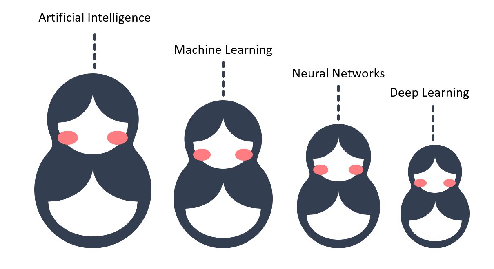
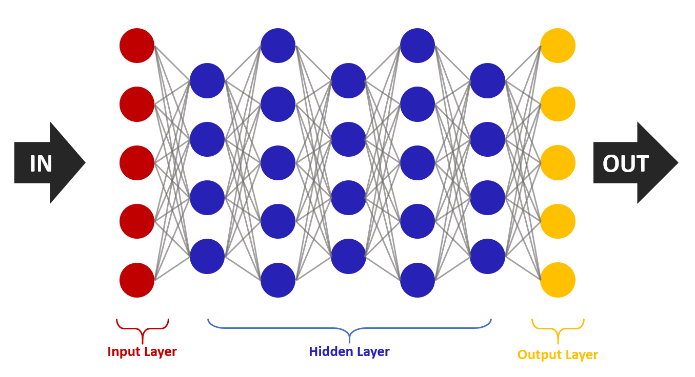

## Relation between AI, Machine Learning, Neural Networks, and Deep Learning

We can see AI, machine learning, neural networks, and deep learning as Russian nesting dolls. Each is essentially a component of the prior term. AI is a field of computer science that able to simulate human intelligence, while machine learning is a subfield of artificial intelligence. It enables a computer to make prediction without being explicitly programmed. Deep learning is the main subset of machine learning, it use huge neural network with many layers of processing unit.

## What is Neural Network
A Neural Network is a kind of machine learning that mimic the human brain through a set of algorithms. A typical brain contains a lot of neuron with a number of connections called edges comming off it. Just like a human brain, neural network consist of a lot of connected nodes called artificial neurons that work together to process information.

Each nodes can pass and receive a signal in a form of real number. The output of each nodes is computed by some non-linear function of the sum of its inputs.