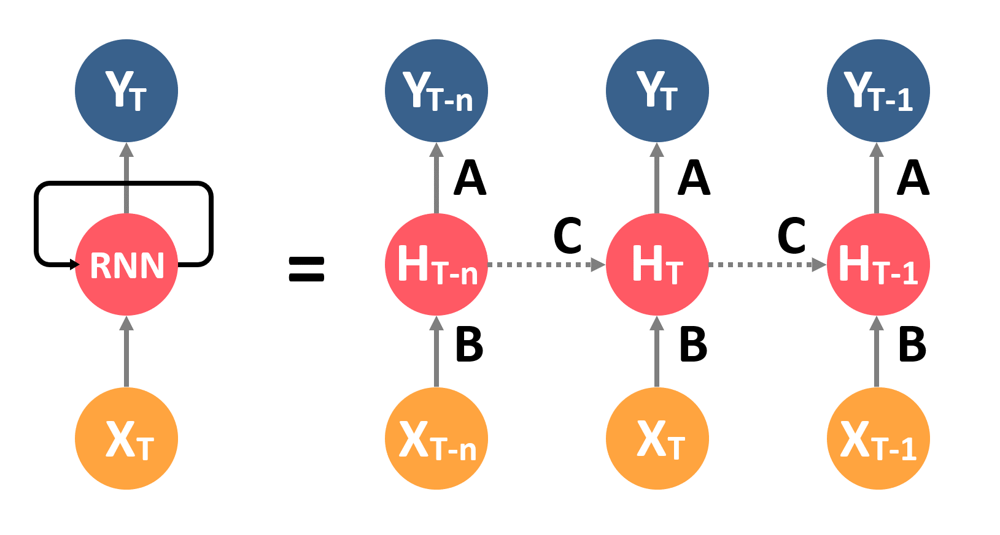

## Introduction to Recurrent Neural Networks (RNN)

RNN are a powerful neural network that able to remember important things about the input they received because it has an internal memory. This algorithm are preferred for sequential data such as speech, text, audio, video, and are used by Apple's Siri and Google's voice search.

### How RNN Work?
RNN works on the principle of saving the output of particular layer and feeding it back as an input in order to predict the output of the layer. the information cycles through a loop to the middle hidden layer. So in RNN, instead of creating multiple hidden layers, it create one hidde layer and loop over it as many times as required.

> RNN structure

## Reference
https://www.simplilearn.com/tutorials/deep-learning-tutorial/rnn