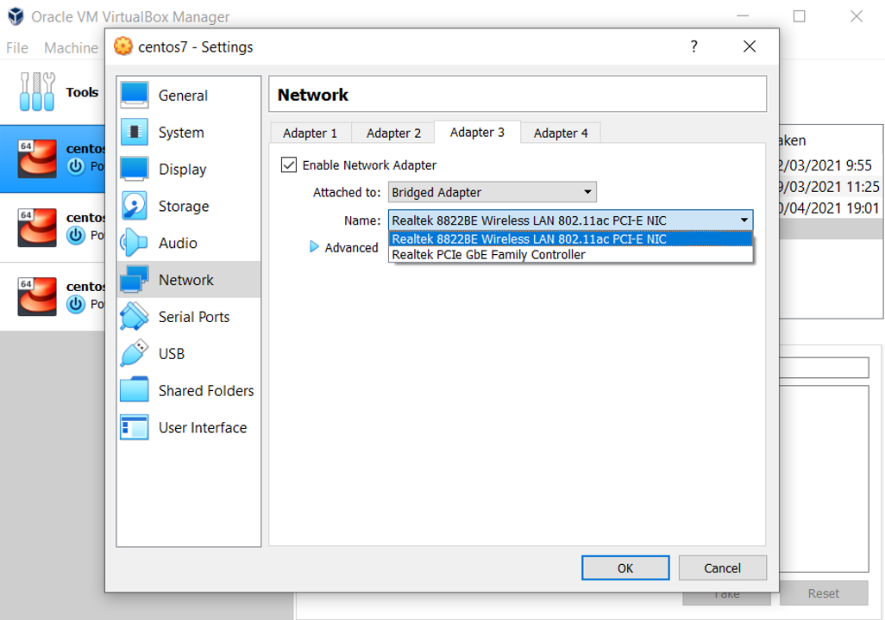
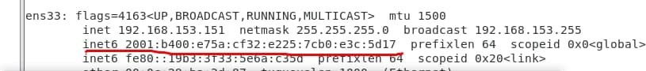
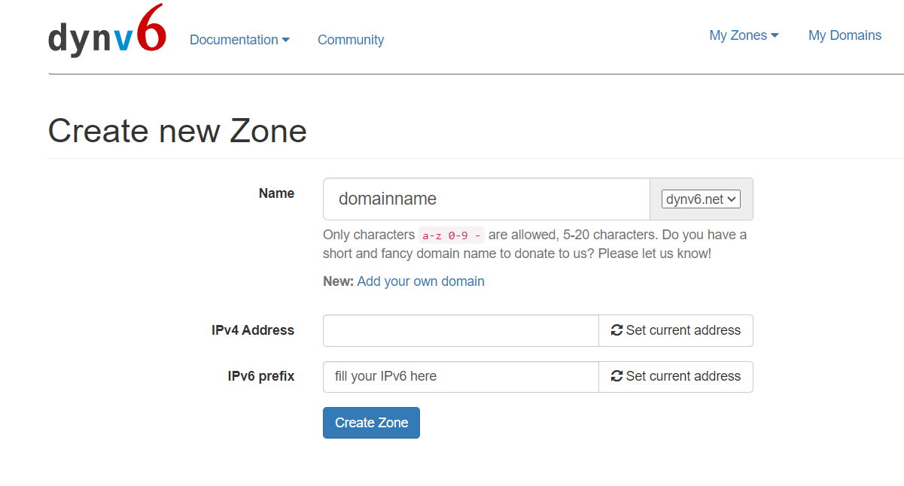

# Automatic Operation and Maintenance for Linux System (Week 1 02/16/2022)
## Hosting Website Using IPv6
By using [dynv6](https://dynv6.com/) we can easily assign public hostnames to private hosts by combining the MAC addresses or Host IDs with dynamic IPv6 prefix. First you need to makesure whether your internet connection have IPv6 or not, you can use [test-ipv6.com](https://test-ipv6.com/index.html) website to test it.
Next in your virtual machine, set a network as `Bridged Adapter`, and select your network adapter. I use VM Box, so the settings would looks like the picture shown below.

<br>

check your VM public IPv6 by typing command `$ ifconfig`, a public IPv6 address would look like this

<br>

after that install and start Apache by executing this several commands:

```
//you can skip this part if you have installed httpd
$ sudo yum install httpd

//start your httpd
$ sudo systemctl start httpd

//stop the firewalld
$ sudo systemctl stop firewalld
```

also make sure that you've already turned off selinux.

Next check whether you can access your website by using IPv6. If you want to access your local host by using IPv6 you should write it like this `[your IPv6]` as the URL. If you can access it, then you can sign in/sign up to [dynv6](https://dynv6.com/), go to My Zone and create a new zone.

<br>

Try to access your website by using the link given, for example `domainname.dynv6.net`. If you can access your website through it, that means you've successfuly host your website by using [dynv6](https://dynv6.com/). But if you have not enable `HTTPS`, you will only able to access your website through `HTTP`. In the next chapter we will learn about [how to enable HTTPS in Apache]().