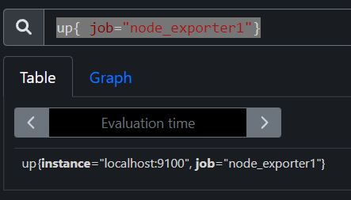
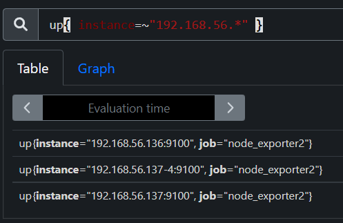
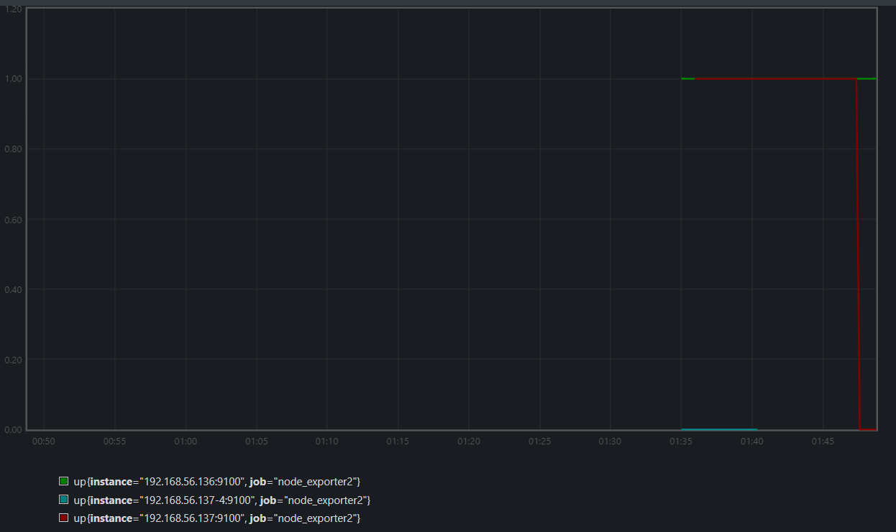
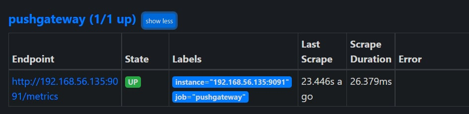

# Automatic Operation and Maintenance for Linux System (Week 10 05/04/2022)

## PromQL (Prometheus Query Language)
PromQL is used for searching function (filtering). For e.x. if you search `up{ job="node_exporter1" }` and execute it, the result will be as shown below.

<br>

and `up{ instance=~"192.168.56.*" }` :

<br>

if we are in search function page, we also able to see the graph, for example if I turn off `192.168.56.137`, as you can see the red line goes down from 1 to 0.

<br>

prometheus will record data for every ~15s, we can use command `node_load1{instance="192.168.56.137:9100"} [1m]` to get the record within 1m, while `node_load1{instance="192.168.56.137:9100"} [1m] offset 5m` will show record within 1m in 5m before.

`prometheus metric have 4 types : Counter, Gauge, Histogram, Summary`.

If you want to know CPU idle time from each device, you can use the folowing query `sum(increase(node_cpu_seconds_total{mode="idle"}[5m])) by (instance)` this will sum each CPU idle time within 5m

While to get the worktime of a device and convert it into percent to compare with other device, you can type this query:
`(1- sum(increase(node_cpu_seconds_total{mode="idle"}[5m])) by (instance)/sum(increase(node_cpu_seconds_total[5m])) by (instance))*100`

you also can check the total memory (aproximate memory) by typing `node_memory_MemTotal_bytes`

there are 4 type of memory:
* node_memory_MemTotal_bytes
* node_memory_MemFree_bytes
* node_memory_Cached_bytes
* node_memory_Buffers_bytes

to get the used memory, you can do this command:
`(node_memory_MemTotal_bytes-(node_memory_MemFree_bytes+ node_memory_Cached_bytes + node_memory_Buffers_bytes)) / node_memory_MemTotal_bytes * 100`


## Setup Grafana
add Grafana repository `# gedit /etc/yum.repos.d/grafana.repo`
```
[grafana]
name = grafana
baseurl = https://packages.grafana.com/oss/rpm
repo_gpgcheck = 1
enabled = 1
gpgcheck = 1
gpgkey = http://packages.grafana.com/gpg.key
sslverify = 1
sslcacert = /etc/pki/tls/certs/ca-bundle.crt
```
install grafana `yum install grafana`

start grafana:
```
# systemctl daemon-reload
# systemctl start grafana-server
```

in browser open `https://<IPAddress>:3000`, for login information input `"admin"` for both username and password. If you manage to login you will see this interface.

<br>

## Setup Pushgateway
1. `# cd /home/user/Downloads`
2. `# wget https://github.com/prometheus/pushgateway/releases/download/v1.4.2/pushgateway-1.4.2.linux-amd64.tar.gz`
3. `# tar xvfz pushgateway-1.4.2.linux-amd64.tar.gz`
4. `# mv pushgateway-1.4.2.linux-amd64 pushgateway`
5. `# mv pushgateway /opt/module/`
6. `# cd /opt/module/pushgateway`
7. `# gedit /usr/lib/systemd/system/pushgateway.service &` write this settings inside the file
```
[Unit]
Description=pushgateway
After=network.target

[Service]
Type=simple
ExecStart=/opt/module/pushgateway/pushgateway 
Restart=on-failure

[Install]
WantedBy=multi-user.target
```
8. `# systemctl daemon-reload`
9. `# systemctl start pushgateway`
10. `# systemctl status pushgateway`
11. `# cd ../prometheus`
12. `# gedit prometheus.yml &` add this several settings into prometheus.yml
```
- job_name: 'pushgateway'
    honor_labels: true
    static_configs:
      - targets: ['192.168.157.135:9091']
```
13. `# systemctl restart prometheus`
after you finished the above command, you will able to see pushgateway on prometheus website

if you managed to setup `pushgateway`, you should able to see it on Prometheus web `status > target` with `up` state.

<br>