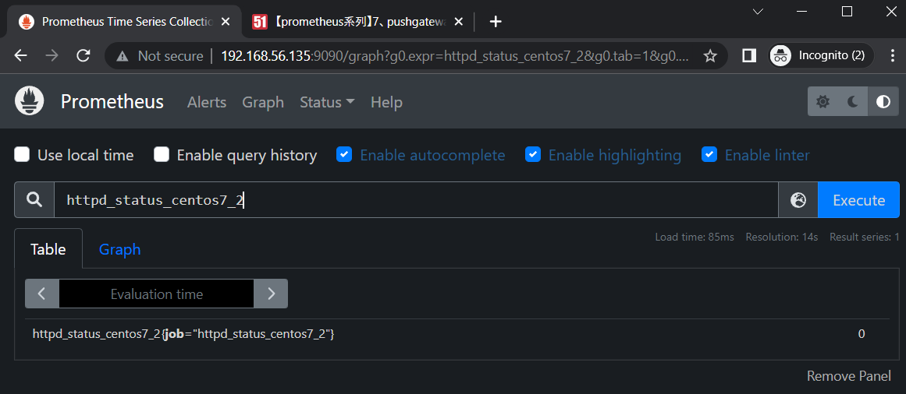
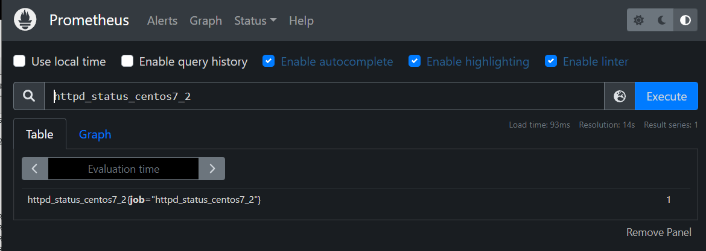

# Automatic Operation and Maintenance for Linux System (Week 11 05/11/2022)

## Send Waiting Connection Status to Prometheus
1. `# mkdir -p /app/scripts/pushgateway`
2. `# cd /app/scripts/pushgateway`
3. `# gedit tcp_waiting_connections.sh` and put the content below inside the file

```
#!/bin/bash

# 获取hostname，且host不能为localhost (這部分可以不用寫)
instance_name=`hostname -f | cut -d '.' -f 1`
if [ $instance_name = "localhost" ];then
  echo "Must FQDN hostname"
  exit 1
fi

# For waiting connections
label="count_netstat_wait_connetions"
count_netstat_wait_connetions=`netstat -an | grep -i wait | wc -l`
echo "$label:$count_netstat_wait_connetions"
echo "$label $count_netstat_wait_connetions" | curl --data-binary @- http://192.168.56.135:9091/metrics/job/pushgateway/instance/$instance_name
```

4. `# chmod +x tcp_waiting_connections.sh`
5. `# ./tcp_waiting_connections.sh`

go back to prometheus query search and search for count_netstat_wait_connection, it will show the status from the number of program that still waiting for connections.

## Send HTTP Status to Prometheus

1. `# cp tcp_waiting_connections.sh check_httpd_centos7_2.sh`
2. `# gedit check_httpd_centos7-2.sh`

```
#!/bin/bash

# For waiting connections
label="httpd_status_centos7_2" #when writing name, don't use -
curl -q http://192.168.56.136 > /dev/null 2>&1
status=`echo $?`
if [ $status -eq 0 ];then
	result=1
else
	result=0
fi
echo "$label $result" | curl --data-binary @- http://192.168.56.135:9091/metrics/job/pushgateway/instance/$instance_name
```

3. install http into your device and start it
4. run the program `# ./check_httpd_centos7_2.sh`
now if you try to turn on and off your http, it will be recorded to phrometheus

<br>

<br>

Next you also can see the graph status from grafana by creating a new dashboard and do this several steps:
1. open grafana `localhost:3000`
2. create new graph
3. insert query "httpd_status_centos7_2"
4. save dashboard

<br>

## Make the Program to Run Periodicaly (every 1 min)
We already write a program that send the status of waiting conection and HTTP status to prometheus. We can enable the program to run automaticaly by using crontab in linux. 
1. `# crontab -e`

```
* * * * * /app/scripts/pushgateway/check_httpd_centos7_2.sh
* * * * * sleep 15;/app/scripts/pushgateway/check_httpd_centos7_2.sh
* * * * * sleep 30;/app/scripts/pushgateway/check_httpd_centos7_2.sh
* * * * * sleep 45;/app/scripts/pushgateway/check_httpd_centos7_2.sh
```

2. `# crontab -l` to check for the current running crontab


---

## LINUX COMMAND

1. `# read -p "what is your name:" name` (will ask user input)

```
what is you name:tom
`# echo $name`
tom
```

2. `# cat <<< "hi"` <br> `<<<` used to put std input to std output

3. `$ touch {a..c}{1..10}.txt`<br>
create file from a1.txt,a2.txt,..,b1.txt,b2.txt,..,c1.txt,c2.txt,..,c10.txt.

4. `$ exec ? 2.txt`<br>
`$ echo "1"`<br>
`$ echo "2"`<br>
`$ echo "3"`<br>
if u try to cat it in other terminal, the content will be:

```
1
2
3
```

5. test what program that still waiting<br>
`# netstat -an | grep -i wait`<br>
to count it, write it like this<br>
`# netstat -an | grep -i wait | wc -l`