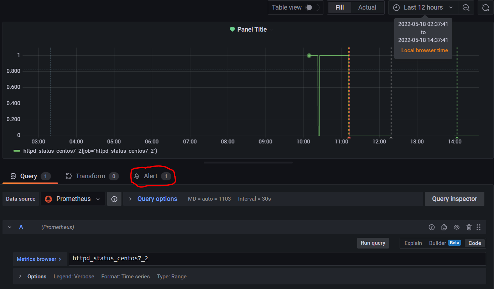
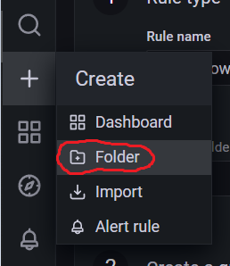
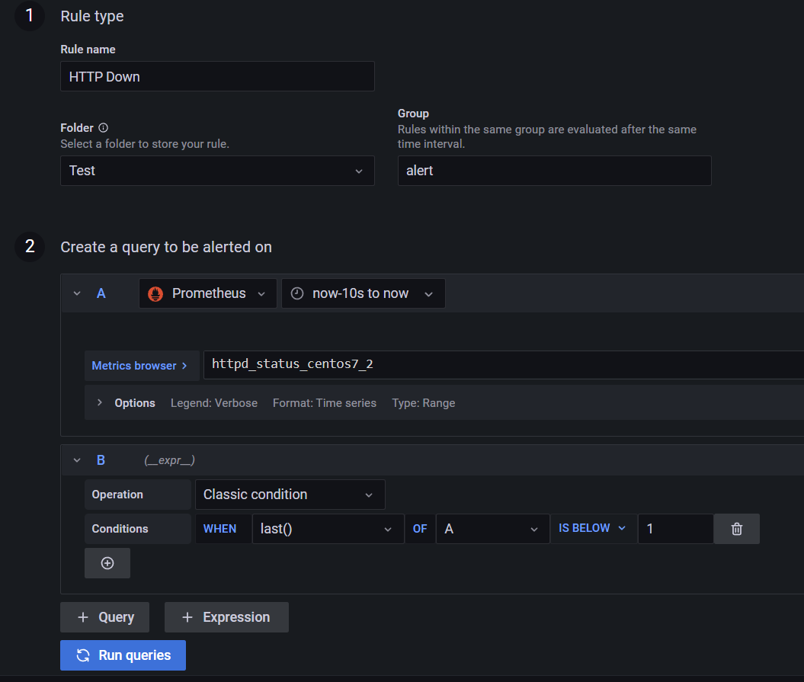
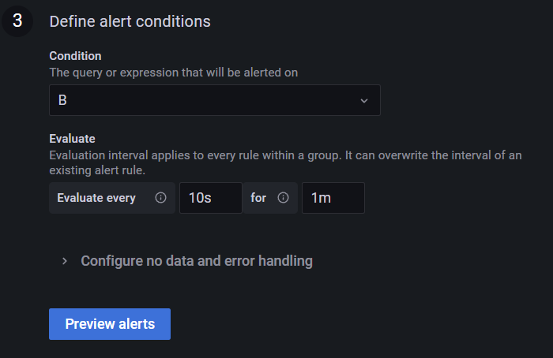
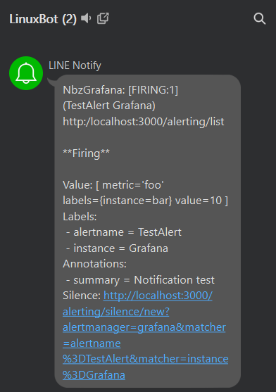
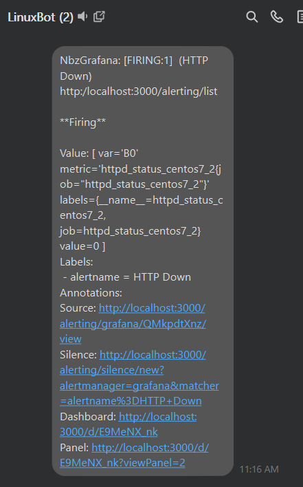

# Automatic Operation and Maintenance for Linux System (Week 12 05/18/2022)
## Send Notification to Line on Server Down
In this part, I use grafana version 8.5.1, you also can try to use version 7.5.15 which have easier settings by running it in docker. If you want to use version 7.5.15, use the following command:

```
docker run -d --name=grafana -p 3000:3000 grafana/grafana:7.5.15
```

Since I use version 8.5.1 so I will show the settings for this version. If you use the other version, the settings will have some different. Last week we already create a new dashboard that show our http status periodicaly. If you haven't create one [go to this link](). In grafana dashboard, click the Alert and add a new one.

<br>

Before you create a new alert, you should create a new folder and give it a name. As an example, I give it name `Test`

<br>

Next follow this several settings at the time you create an alert :

<br>
<br>

While for settings number 4, just leave it with the default description, or you can change it as you need.

Last we also need to set our default contact point into line. As default there will have `grafana-default-email` in your contact point, change it into line and input your line token. To get your line token, you need to go to this website https://notify-bot.line.me/my/. Next create a group in Line and invite line notify into those group. In line website click `Generate Token`, choose your group and don't forget to copy your token. Paste your token on our Grafana alert settings, test it and you should receive this notification on your line

<br>

Next try to turn off the HTTP, soon you should receive this notification

<br>