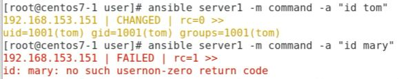

# Automatic Operation and Maintenance for Linux System (Week 14 06/01/2022)

## Install vsftpd to all client using playbook ansible

To install vsftpd into all client that are connected to the server, we need to write some command in `playbook.yml` file and a configuration file `vsftpd.conf`. If you have ftp installed in your server, you can find the configuration file in `/etc/vsftpd/vsftpd.conf`, if you have not install it then execute command `# yum install -y ftp` to install the package. Put both of the file in the same folder. In `playbook.yml` write the following command:
```
- hosts: server1
  tasks:
    - name: install vsftpd server
      yum: name=vsftpd state=present
    
    - name: start vsftpd server
      service: name=vsftpd state=started enabled=yes
```

make some change into `vsftpd.conf` :

```
anonymous_enable=No
local_enable=YES
write_enable=YES
local_umask=022
dirmessage_enable=YES
xferlog_enable=YES
connect_from_port_20=YES
xferlog_std_format=YES
listen=NO
listen_ipv6=YES

pam_service_name=vsftpd
userlist_enable=YES
tcp_wrappers=YES
```
to run the file, execute the following command `# ansible-playbook playbook.yml`

## Ansible Command

1. check whether user `tom` is exist in server1<br>
`# ansible server1 -m command -a "id tom"`<br>
check whether user `mary` is exist in server1<br>
`# ansible server1 -m command -a "id mary"`

It show that `tom` has already existed in server1 while `mary` is not.  

2. add new user<br>
`# ansible server1 -m user -a "name=mary uid=1100 state=present"`<br>
check user<br>
`# ansible server1 -m command -a "id mary"`<br>
while to delete user use the following command<br>
`# ansible server1 -m user -a "name=mary state=absent"`<br>
in adding new user, you also able to set their password<br>
`# ansible server1 -m user -a "name=tom1 password={{'tom1'|password_hash('sha512')}}"`

3. create group<br>
`# ansible server -m group -a "name=manager state=present"`