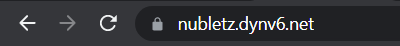

# Automatic Operation and Maintenance for Linux System (Week 2 02/23/2022)
## Enable HTTPS on Apache
After hosting a website using IPv6 from our last notes, this time we will enable HTTPS on our website. It's important to enable encrypted HTTPS in our website, so that user can browse our website securely. In order to do that, we need to install certbot, a software that would automates most of the steps.
### Step 1. Installing Certbot
We need to install `Certbot` and `mod_ssl`, and also make sure that you have Apache installed, if you have not installed it yet then you need to [install Apache](https://github.com/NubletZ/myNotes/blob/master/allNotes/Server-Setup/Week6.md#Install-Apache) first. The certbot package is not available through package manager by default. So to install it we need to enable EPEL repository.

```
$ sudo yum install epel-release mod_ssl certbot
```
### Step 2. Obtaining a Certificate
to obtain a certificate we need to type the below command

```
$ sudo certbot certonly --webroot -w /var/www/html -d nubletz.dynv6.net --email youremail@email.com --agree-tos
```

change `nubletz.dynv6.net` with your own website url.

After execute the above command you will get this output:

```
Output
Please choose whether or not to redirect HTTP traffic to HTTPS, removing HTTP access.
- - - - - - - - - - - - - - - - - - - - - - - - - - - - - - - - - - - - - - - -
1: No redirect - Make no further changes to the webserver configuration.
2: Redirect - Make all requests redirect to secure HTTPS access. Choose this for
new sites, or if you're confident your site works on HTTPS. You can undo this
change by editing your web server's configuration.
- - - - - - - - - - - - - - - - - - - - - - - - - - - - - - - - - - - - - - - -
Select the appropriate number [1-2] then [enter] (press 'c' to cancel): 2
```
Input number 2 and press enter. Next if the installation is successfully finished, you will see an output like this :

```
Output
IMPORTANT NOTES:
 - Congratulations! Your certificate and chain have been saved at:
   /etc/letsencrypt/live/nubletz.dynv6.net/fullchain.pem
   Your key file has been saved at:
   /etc/letsencrypt/live/nubletz.dynv6.net/privkey.pem
   Your cert will expire on 2022-02-23. To obtain a new or tweaked
   version of this certificate in the future, simply run certbot again
   with the "certonly" option. To non-interactively renew *all* of
   your certificates, run "certbot renew"
 - If you like Certbot, please consider supporting our work by:

   Donating to ISRG / Let's Encrypt:   https://letsencrypt.org/donate
   Donating to EFF:                    https://eff.org/donate-le
```

### Step 3. Modify ssl.conf File
edit the `ssl.conf` file by executing `$ vim /etc/httpd/conf.d/ssl.conf`. You need to change 3 file path for `SSLCertificateFile`, `SSLCertificateKeyFile`, and `SSLCACertificate`. For example the directory path to the certificate is `/etc/letsencrypt/live/nubletz.dynv6.net/`, change the path into :

```
...
SSLCertificateFile /etc/letsencrypt/live/nubletz.dynv6.net/cert.pem
...
SSLCertificateKeyFile /etc/letsencrypt/live/nubletz.dynv6.net/privkey.pem
...
SSLCACertificate /etc/letsencrypt/live/nubletz.dynv6.net/fullchain.pem
...
```

After that save the file and we will able to access the website by using HTTPS `https://nubletz.dynv6.net`. You also will see a lock sign beside your link, that means you access the website using `HTTPS` and your connection is secure.

<br>