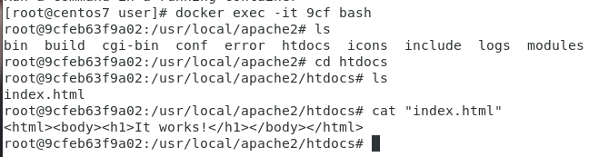
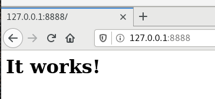
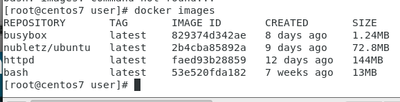
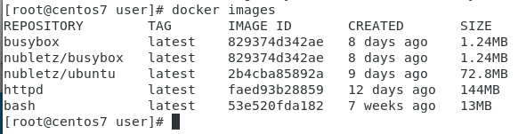

# Automatic Operation and Maintenance for Linux System (Week 4 03/09/2022)
## File System in Docker
If we have an image and we run it, it will become docker. In docker we use AUFS layer architecture. For example if in begining we have one layer (layer 1) contain a.txt file, if we want to create another file named b.txt, then it will create a new layer (layer 2) and a.txt will become read only. So, from top to bottom user will see that the system have a.txt and b.txt. But if we need to edit a.txt, the changes will be saved to layer 3, while the original a.txt in layer 1 become hidden.

you need to know that if you do some operation like adding modifying, deleting, it will create a new layer in layer 3. if this docker is stopped, everything in layer 3 will gone. So, if you want to maintain layer 3 you should keep running an image, or else all program in layer 3 will gone. To save your progress you need to do docker commit by first leave docker use `ctrl+p` after that `ctrl+q` after that execute the following command:

```
# docker commit [container]
```

### Enable docker execute more command
Docker is so small, so it can't do so many command, even a basic command such as ping and ifconfig are not included in docker. But you can add it to docker by including `busy box` into your docker. First you need to pull the busy box :

```
# docker pull busybox
```

after that run docker with busybox :

```
# docker images
# docker run -it busybox sh
```

This way you will able to do more command in docker.

### Open another terminal for the same docker
if you want to create another terminal for the same docker you can't use command `# docker attach` because it will open the same terminal and both terminal will running the same things. To open new terminal you need to type

```
# docker exec -it [container] sh
```

this way you can use the other terminal to run other program.

### Host website by using docker
First you need to pull http to docker

```
# docker pull httpd
```

After that try to run docker http on specific port, for example we host the docker website on port `8888:80` but first we need to make sure that there is no other program that use that port

```
# netstat -tunlp | grep 80
# docker run -d -p 8888:80 httpd
```

from the last command it will show an output of your docker ID, try to access it by typing `# docker exec -it [ID] bash`. 

<br>

Change directory into `htdocs` and you will find `index.html` file. Open your browser and access that port, you will see something like this :

<br>


### Push and pull docker to dockerHub
Make sure that you have create an account on `Docker Hub` after that type `# docker login` and input your account data.

<br>

For example if we want to push busybox repository to `nubletz` Docker Hub then we need to type this several command :

```
# docker tag busybox:latest nubletz/busybox:latest
```

<br>

Now if we execute docker images command, we will see `nubletz/busybox` repository. Push the repository by typing the following command :

```
# docker push nubletz/busybox:latest
```

<br>

Go to check you docker hub and you will find the repository that you have just pushed. If you delete your local repository and want to pull it from Docker Hub then execute this command :

```
# docker pull nubletz/busybox:latest
```

---
## Commands

#### `# docker images`
to run image

#### `# docker run -it ubuntu bash`
`-i` : itterative

`-t` : terminal

used to run docker


#### `# docker rm -f [id]`
`-f` : force

use this command to remove running docker

#### `# docker rm -f $(docker ps -a -q)`
this command is used to delete all running docker

#### `# docker commit [container]`
write the id for container, you can just write 3 or several characters from docker ID

#### `# docker attach [container]`
used to go back to the same docker