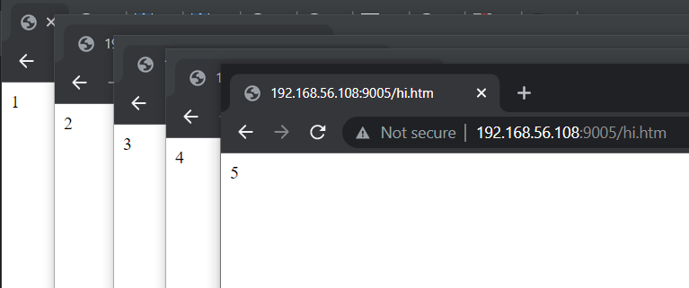
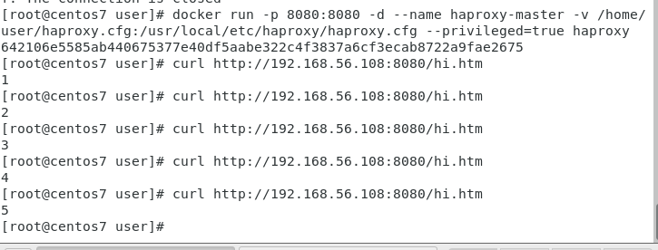

# Automatic Operation and Maintenance for Linux System (Week 4 03/16/2022)

## Auto creating several web folder using shell script

First create the shell script file, I name it as `prepare_web.sh`
```
# gedit prepare_web.sh
```

Put the code below into `prepare_web.sh` file

```
#!/usr/bin/bash

for i in {1..5};
do
   mkdir -p myweb$i
   cd myweb$i
   echo $i > hi.htm
   cd ..
done
```

execute the command below :

```
# chmod +x prepare_web.sh
# ./prepare_web.sh
# gedit docker_httpd_setup5.sh
```

in docker_httpd_setup5.sh, write the following code:

```
#!/usr/bin/bash

for i in {1..5};
do
	portno= `expr 9000 + $i`
	docker run -d -p $portno:80 -v /home/user/myweb$i:/usr/local/apache2/htdocs httpd
done
```

make docker_httpd_setup5.sh become executable file by typing this several command :

```
# chmod +x docker_httpd_setup5.sh
# ./docker_httpd_setup5.sh
```

this way you will able to see your website from your local host

<br>

## Creating docker image using Dockerfile 
you need to know that when you want to create new image file there are two ways: docker commit and Dockerfile

#### `# gedit Dockerfile`

and put this several line :

```
FROM centos:centos7
RUN yum -y install httpd
EXPOSE 80
ADD index.html /var/www/html
```

#### `# echo "hello world" > index.html`
to connect docker with the directory from your current device, you can type the following command :
#### `# docker build -t myhttpd:1.0 .`
#### `# docker run -d -p 8888:80 myhttpd:1.0 /usr/sbin/apachectl -DFOREGROUND`

this way if you access your website from localhost `ipaddress:8888`, you will see "hello world".

## Set haproxy for pages in docker

#### `# vim /home/user/haproxy.cfg`

insert the following line of settings into `haproxy.cfg`

```
defaults
  mode http
  timeout client 10s
  timeout connect 5s
  timeout server 10s
  timeout http-request 10s

frontend myfrontend
  bind 0.0.0.0:8080
  default_backend myservers

backend myservers
  balance roundrobin
  server server1 192.168.56.113:9001
  server server2 192.168.56.113:9002
  server server3 192.168.56.113:9003
  server server4 192.168.56.113:9004
  server server5 192.168.56.113:9005
```

change the ipaddress with your own device ipaddress

#### `# docker run -p 8080:8080  -d --name haproxy-master -v /home/user/haproxy.cfg:/usr/local/etc/haproxy/haproxy.cfg --privileged=true haproxy`

after executing the above code you will see your website will keep changing its content from 1 > 2 > 3 > 4 > 5 each time you refresh it

<br>


## Installing python environment in docker
first embeding python into docker by typing this code
#### `# docker pull faucet/python3`
run the docker that have python installed
#### `# docker run -it -v /home/user:/mydata faucet/python3 bash`
in docker, type this several command to check whether the python was installed properly
#### `# cd /mydata`
#### `# ls`
#### `# python3 test.py`

if the python has been installed successfully you should see the output

```
hello world
```

---

## COMMAND
#### `# mkdir -p`
`-p` : will make dir only if the directory hasn't existed yet

<br>

#### `# ifconfig enp0s8 | grep netmask | awk '{print $2}'`
use to print your ipaddress

#### 