# Automatic Operation and Maintenance for Linux System (Week 7 03/30/2022)

## Update Kernel
To update kernel we can download the resource from this website https://www.kernel.org/. This time we will try to install kernel version 4.19.237.

```
# wget https://cdn.kernel.org/pub/linux/kernel/v4.x/linux-4.19.237.tar.xz
```

after that extract the compressed file by using the following command:

```
# tar xvJf linux-4.19.237.tar.xz
```

There are several modules that need to be installed, execute the following command to install it

```
yum install -y ncurses-devel make gcc bc bison flex elfutils-libelf-devel openssl-devel grub2
```

We can copy our current configuration for our new centos kernel configuration

```
# cp -v /boot/config-3.10.0-1127.19.1.el7.x86_64 .config
```

after that follow this several steps

```
# make menuconfig
```

on executing the above command, you will see this interface :

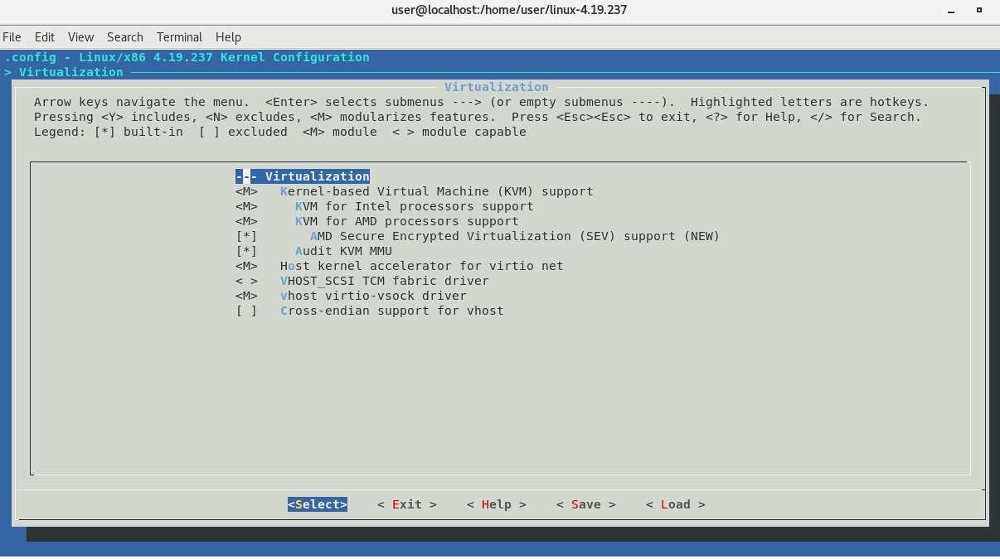<br>

 >* `[*]` : means compile this feature into kernel, the dissadvantage it will have bigger size
 >* `<M>` : it will make the feature become module, means it will load the feature into kernel if needed
 >* `[ ]` : won't load the feature into kernel

Continue to execute the following command :
```
# make bzImage
# make modules
# make
# make modules_install
# make install
# grub2-mkconfig -o /boot/grub2/grub.cfg
```

and last reboot your device `# reboot`.

Now at the time you booting your device, you can choose your new Kernel version.

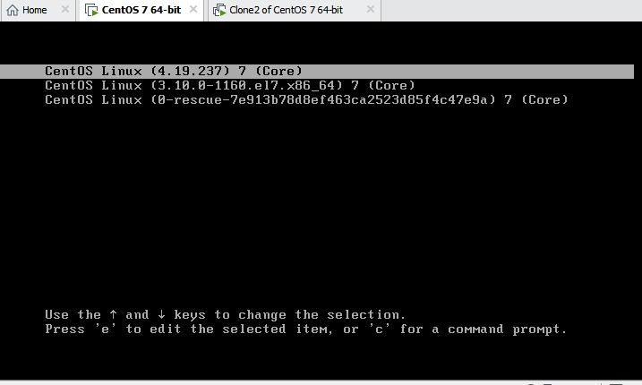<br>

try to execute command `uname -r` and you will get an output `4.19.237`.

## JumpServer
What is JumpServer and why we use it? For e.x. we have 5 servers with each have different password. To login we need to remember a lot of account name and password. It would not be easy for management. The other things is to audit, when some one do something wrong into system we need to . The third is when we need to prevent someone do something dangerous like rm -rf.

The jumpserver will memorize the account name and pass. What user do will be recorded by jumpserver. If jumpserver detect a user want to execute dangerous things, it will block it. Jumpserver have 4A `authentication`, `authorization`, `accounting`, and `auditing`.

There are three role in JumpServer
1. `SystemAdmin` : can do anything, just like root
2. `SystemAuditor` : can know the history from user
3. `User`

## Install and Set Up JumpServer
Today we will use docker to install JumpServer, first we need to execute the command below :

```
# sudo curl -L "https://github.com/docker/compose/releases/download/1.29.2/docker-compose-$(uname -s)-$(uname -m)" -o /usr/local/bin/docker-compose
```

after that add execute permission into docker-compose by using the following command :

```
# sudo chmod +x /usr/local/bin/docker-compose
# docker images
```

After that git clone the following repository:

```
# git clone --depth=1 https://github.com/wojiushixiaobai/Dockerfile.git
# cd Dockerfile
# cp config_example.conf .env
```

next we also need to change the ip address in `.env` into `172.20.0.0/16`. You can use command `# gedit .env` to edit the file. Finaly execute the command below, we use docker compose to let each docker communicate with each other :

```
# docker-compose -f docker-compose-redis.yml -f docker-compose-mariadb.yml -f docker-compose.yml up
```

if you find any error in executing the above command, you can try to solve it by execute this several command :

```
# docker ps -a
# docker rm -f `docker ps -a -q`
# docker-compose down
```

if in error message is related about ip tables, you can try to reset your docker by using the following command `# systemctl reset docker`.

after that execute the below command again 

```
# docker-compose -f docker-compose-redis.yml -f docker-compose-mariadb.yml -f docker-compose.yml up
```

try to type your device ip address on your browser, and you should see this interface 

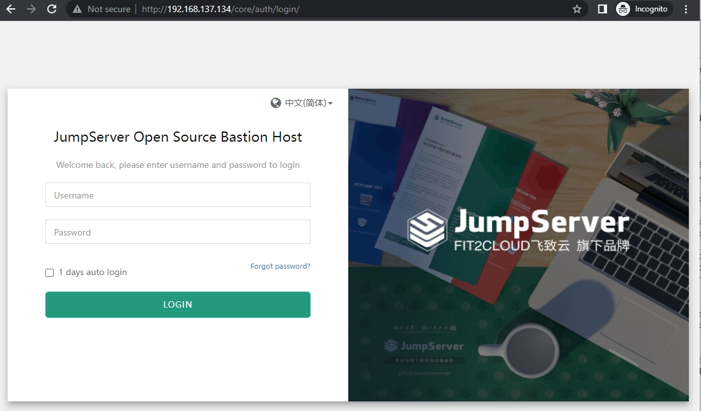<br>

Now we can start to create the user, asset, and asset permission. To create the user, from dashboard chose user and click the create button. After that fill in the data as shown below.

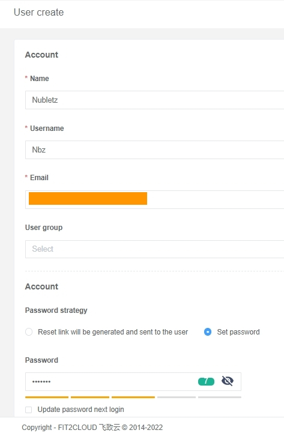<br>

and also set the system roles into `User`.

Next create an asset with a setting as shown below :

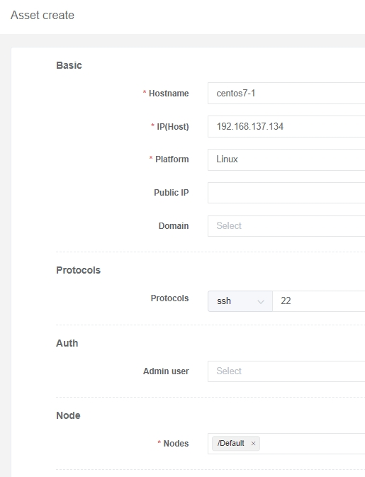<br>

Change the IP(Host) with your own IP address. For now just leave admin user blank because we have not make any admin user yet. After that open the dashboard and chose system users. You will see two options there `Common uer` and `Admin user`, we first create the common user by clicking create and choose SSH. You need to fill in the `name`, `username`, and `password`.

After you finished, create an admin user with the same step. Click create, choose SSH, fill in the `name`, `username`, and `password`.

Since now we already have Admin user we need to go back to assets and update Centos7-1. Set the admin user into root. Now we can test Centos7-1 by click its name on Assets list and click test button. If JumpServer can reach our device, it will show a success ping as shown below :

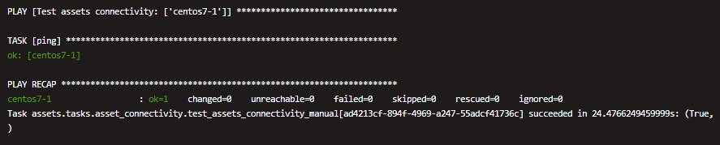<br>

Now we need to create asset permissions for our user

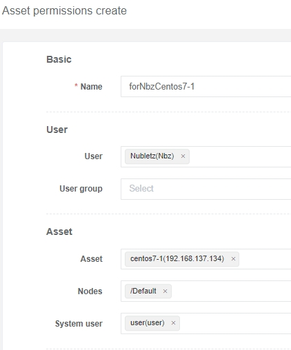<br>

Now we can try to login as `nbz` into the server with JumpServer already set up. The interface would looks like this : 

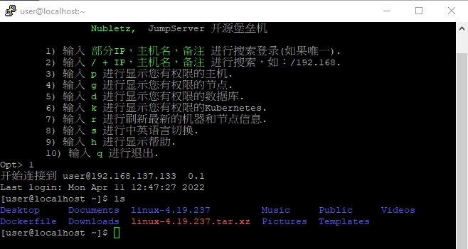<br>

We also able to set some command filter to prevent user type some command that will harm the server. For example if we want to prevent `nbz` from executing `rm -f`, we can go to command filter, set the basic setting :

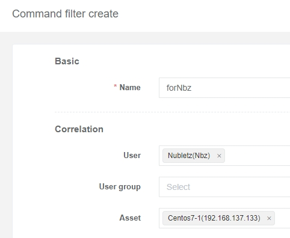<br>

and after that specify the command:

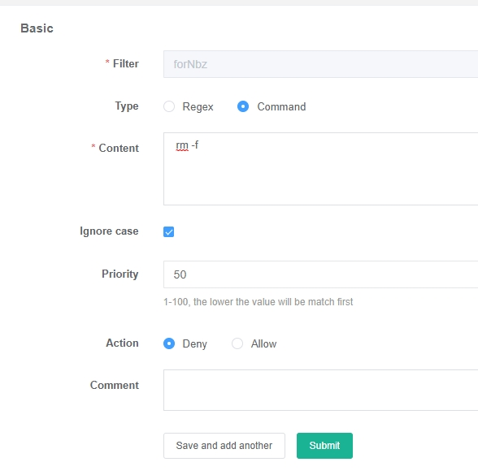<br>

Now if we login as `nbz` and try to type `rm -f`, the server will not execute it

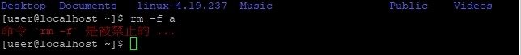<br>