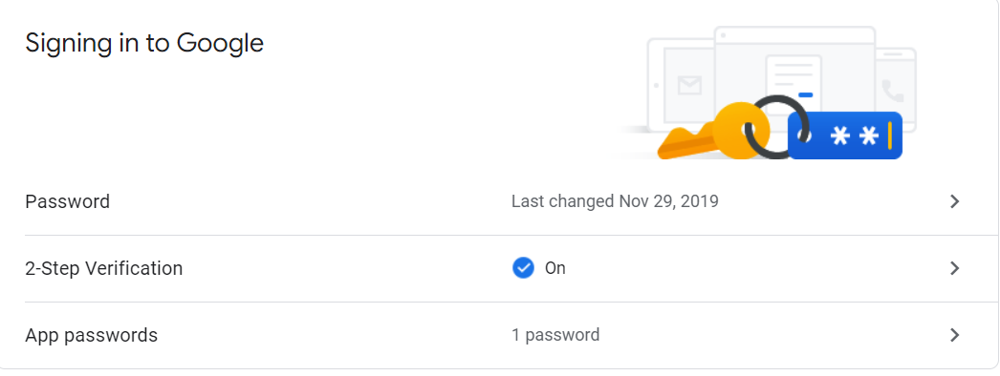
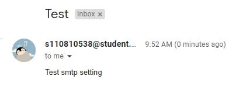

# Automatic Operation and Maintenance for Linux System (Week 8 04/13/2022)

## Connect JumpServer with email

Start your jumpserver by typing command

```
# docker-compose -f docker-compose-redis.yml -f docker-compose-mariadb.yml -f docker-compose.yml up
```

Also make sure that your google account have a two steps verifications, you can check it on this page https://myaccount.google.com/security. After you have enabled two steps verifications, click app pasword

<br>

select app and choose other, fill the app name as `jumpserver` and generate. After that it will show your app password, keep those password and don't share it to anyone.

Next we login to jumpserver website and open the email settings. Fill in the form according to your information, as e.x. :

```
SMTP user: [Fill in your email]
SMTP host：smtp.gmail.com
SMTP port：465
SMTP security mode：SSL/TLS

SMTP authentication：yes

SMTP account： [Fill in your email]

SMTP password：[Fill in with the app pasword that you've got from Google]
```

now click submit and test connection, at the time you check your email you should see a test email.

<br>

---

## grep flags

```
grep -A2 b test
```
- `A2` : show 2 lines after found 'b'
- `A` : show after
- `A` : show before
- `C` : show before and after
- `c` : count
- `e` : find several string from content
- `i` : ignore upper case and lower case