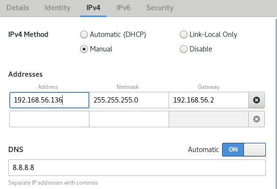
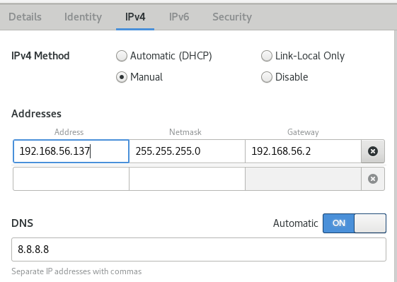
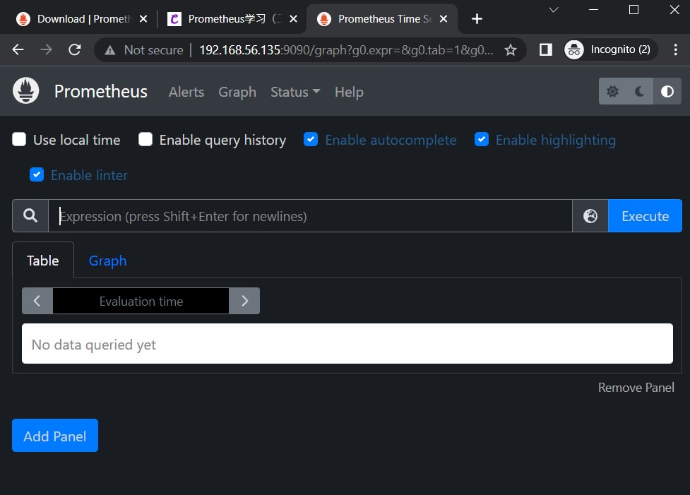
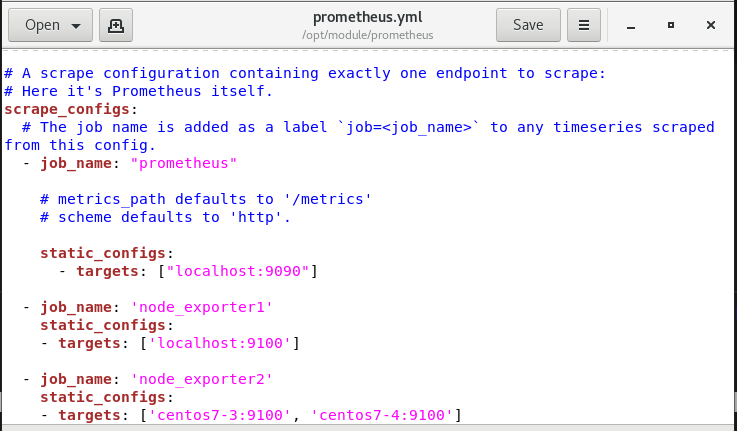
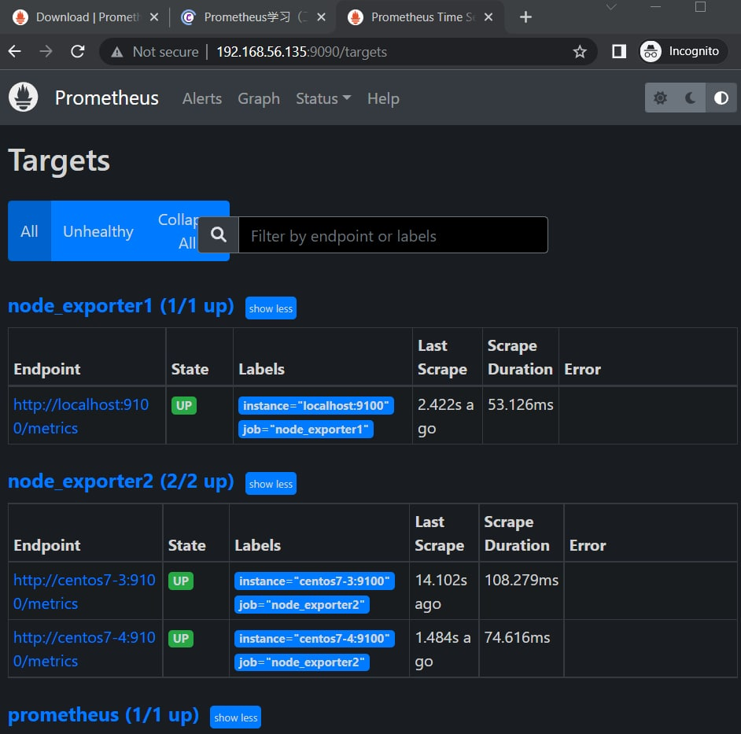

# Automatic Operation and Maintenance for Linux System (Week 9 04/20/2022)

## Setup Promotheus
prepare 3 vm and change their hostname, as example I change it as `centos7-2`, `centos7-3`, `centos7-4`.

change hostname command :

`# hostnamectl set-hostname centos7-2`

setting the ip address for virtual host network as shown below :

<br>

> Centos7-2

<br>

<br>

> Centos7-3

<br>

<br>

> Centos7-4

<br>

change /etc/hosts content by using command :

`# gedit /etc/hosts` 

and add the following line

```
192.168.56.135 centos7-2
192.168.56.136 centos7-3
192.168.56.137 centos7-4
```

try to ping all of the vm :

```
# ping -c 1 centos7-2
# ping -c 1 centos7-3
# ping -c 1 centos7-4
```


next download prometheus by executing the following command :

```
# cd /home/user/Downloads
# wget https://github.com/prometheus/prometheus/releases/download/v2.35.0/prometheus-2.35.0.linux-amd64.tar.gz
```

add group and user

```
# groupadd prometheus
# useradd -g prometheus -m -d /var/lib/prometheus -s /sbin/nologin prometheus
```

create directory /opt/module and extract the file there

```
# mkdir -p /opt/module
# tar xf prometheus-2.35.0.linux-amd64.tar.gz -C /opt/module
  280  cd /opt/module
```

change permission for the file and change it's name

```
# chown -R prometheus.prometheus prometheus-2.35.0.linux-amd64
# mv prometheus-2.35.0.linux-amd64/ prometheus
```

make sure that you have httpd installed and is running, next :

```
# cd /usr/lib/systemd/system
# gedit prometheus.service &
```

add the following settings into `prometheus.service`

```
[Unit]
Description=Prometheus
After=network-online.target

[Service]
Type=simple
Restart=on-failure
ExecStart=/opt/module/prometheus/prometheus --config.file=/opt/module/prometheus/prometheus.yml --storage.tsdb.path=/opt/module/prometheus/data --storage.tsdb.retention=30d --web.enable-lifecycle --log.level=debug

[Install]
WantedBy=multi-user.target
```

save it and start prometheus `# systemctl start prometheus`. If it's failed to start, you can try to `# systemctl daemon-reload` first. Don't forget to close the firewall to access it from browser in your PC.

You should see this interface if you access your `ipaddress:9090` from your browser.

<br>

Next for all 3 vm, you need to install node_exporter, the step is similar to the above steps

1. `# cd /home/user/Downloads`
2. `# wget https://github.com/prometheus/node_exporter/releases/download/v1.3.1/node_exporter-1.3.1.linux-amd64.tar.gz`
3. `# tar xvfz node_exporter-1.3.1.linux-amd64.tar.gz`
4. `# mv node_exporter-1.3.1.linux-amd64 node_exporter`
5. `# mv node_exporter /opt/module`
6. `# cd /usr/lib/systemd/system`
7. `# gedit node_exporter.service &`

add the following settings

```
[Unit]
Description=node_exporter
Documentation=https://github.com/prometheus/node_exporter
After=network.target
 
[Service]
Type=simple
ExecStart=/opt/module/node_exporter/node_exporter
Restart=on-failure

[Install]
WantedBy=multi-user.target
```

8. save it and start node_exporter `# systemctl start node_exporter`

Don't forget to close the firewall in all of those 3 machines

last in centos7-2 edit `prometheus.yml` file

```
# gedit /opt/module/prometheus/prometheus.yml
```

<br>

9. restart your prometheus `# systemctl restart prometheus`

If you check in your web, at the above navigation bar choose `status` > `target` you will see that the other 2 devices are up.


<br>