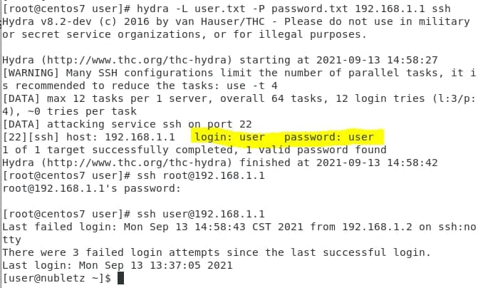
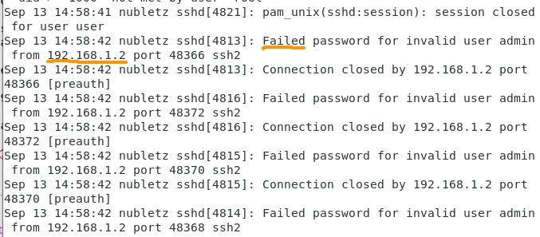
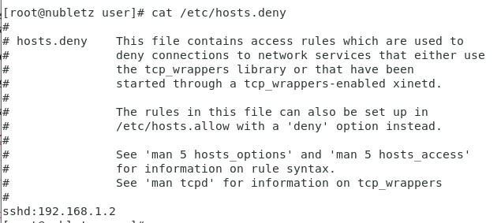

# Server Setup Week 1 (09/14/2021)
## Attack A Server
To try this section we need two Virtual Machines. For both devices we need to make sure that the ssh is running by executing this command `$ systemctl status sshd` if it's not running then you need to write command `# systemctl start sshd`. Don't forget to turn off the firewall and security Linux on the device that we want to attack. Write command `# systemctl stop firewalld` to turn off firewall and to turn off security Linux write `# gedit /etc/selinux/config` and change SELINUX to disabled `SELINUX=disabled`.

For the device that would be use to attack we need to install epel-release and hydra.

```
# yum install epel-releasse
# yum install hydra
```
after you install it you need to write down a list of possible username and password in a file. Example :

```
password.txt
------------
cecilia
user
letmein
food


user.txt
--------
admin
root
user
drink
```
or you can simply download [rockyou.txt](https://github.com/brannondorsey/naive-hashcat/releases/download/data/rockyou.txt). For example if the attacker device's IP address is `192.168.1.2` and the device that we want to attack is `192.168.1.1` then write the command like this :

```
# hydra -L user.txt password.txt 192.168.1.1 ssh
```
if the program is success, you will see the  matching username and password like the picture shown below

<br>

While if you try to check it from device that attacked by executing command `# cat /var/log/secure` you will see several failed login attempt in history.

<br>

You also can see the IP address of device that have failed to log into your account `192.168.1.2`.

## Defend Server From Attacker
Hacking need several login attempts to try all possibility for matching password and user from the list. It's nearly impossible to hack server just in one login attempt. Hence you can defend your server by banned a login from IP address that has failed to log into your server several time.

Write a new file, name it as `block-ip.sh` (the filename is up to you as long as it follows *.sh) and write the code below in it :

```
#!/usr/bin/bash

cat /var/log/secure | grep -v "invalid" | awk '/Failed password/ {print $11}' | awk '{i=$1;ips[i]++}END{for(i in ips)if(ips[i]>=3)print("sshd:" i)>>"/etc/hosts.deny"}'
```

give the file permission to be executed and then run it

```
# chmod +x block-ip.sh
# ./block-ip.sh
```

this way if you try to attack  this device from another device, you may get output

```
ssh_exchange_identification: read: Connection reset by peer
```

while in your device that being attacked if you write command `# cat /etc/hosts.deny` you will see the attacker IP address was written at the bottom.

<br>
