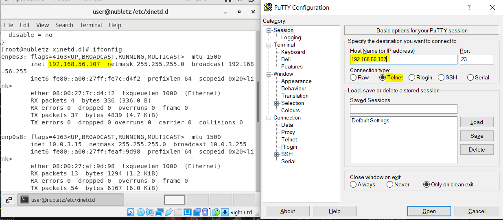
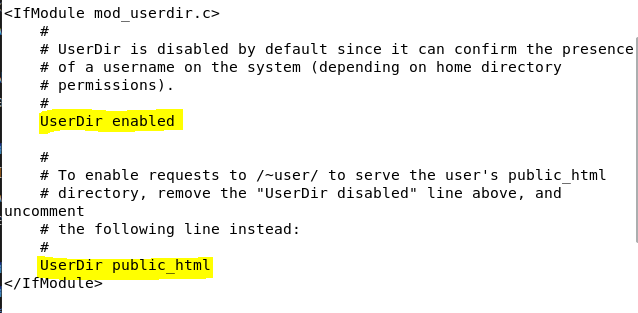
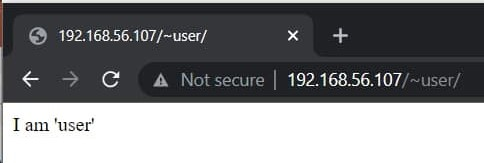
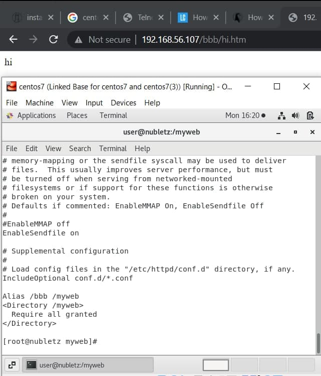

# Server Setup Week 10 (12/06/2021)

in Linux there are two different service, `standalone` and `xinetd`. Standalone means in the begining all service are already running, So it will consume memory. if there is user request, the service can provide it directly. While xindetd won't running on boot. If the user send a request for service, the agent will tell the server to provide it's service. The backdraw is it take longer time.

## Install and Set Up xinetd server
Xinetd (Extended Internet Services Daemon) is an open-source daemon that manages Internet-based connectivity. To set up xinetd server we need to install telnet :

```
yum install telnet
yum install telnet-server
```

Check whether there is xinetd installed in your device by typing :

```
rpm -qa | grep xinetd
```

if you have not install it yet, execute the command below :

```
yum install -y xinetd
```

after that `cd /etc/xinetd.d` and `gedit telnet`. Put the text below inside telnet file :

```
service telnet

{
  flags = REUSE
  socket_type = stream
  wait = no
  user = root
  server = /usr/sbin/in.telnetd
  log_on_failure += USERID
  disable = no
}
```

<br>

Now you'll be able to access your account from putty by choosing telnet and insert your public IP address.

## Linux Scheduling
In linux system there are 2 scheduling service, `cron` and `atd`. Cron will execute service periodically at specific time. While atd will execute exactly once at specific moment in the future.

## HTTP
### HTTP request methods
* `GET` request using get will retrieve head and body.
* `HEAD` request using head will retrieve only the head.
* `POST` the post method submits an entity to the specified resource, often causing a chang in state or side effects on the server. The post method often used in login page to submit login info.

### Make home page for each user in website
To enable each user can have their own home page in website, you can change the configuration by execute this command :

```
vim /etc/httpd/conf.d/userdir.conf
```

you need to change from `userDir disable` into `userDir enable`, also remove `#` from `# userDir public_html`.

<br>

restart the http `sudo systemctl restart httpd`. after that change from super user into user mode. Make the `public_html` directory and write some index file into it.

```
//make public_html directory and make it accessible
su - user
mkdir public_html
sudo chmod 755 public_html

//create index.html file
cd public_html
echo "I am user" > index html

//change user directory's accesssible
cd /home
sudo chmod 755 user
```

This way you can open user's home in website by entering `IPaddress/~username`

<br>

### Make html file that is not in /etc/var/www/html accessible in browser
You also can access other directory by changing some configuration in `httpd.conf`. For example I make `myweb` dir in root directory, and add `hi.htm` file into it. Next edit the `/etc/httpd/conf/httpd.conf` file and add this text at the end of its line :

```
Alias /bbb /myweb
<Directory /myweb>
    Require all granted
</Directory>
```
`/bbb` is alias for `/myweb`. Restart the server `sudo systemctl restart httpd` and then you'll able to access `hi.htm` by typing `ipAddress/bbb/hi.htm`.

<br>