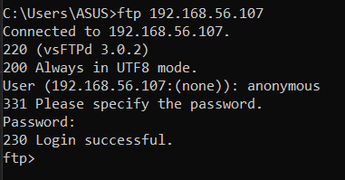

# Server Setup Week 11 (12/13/2021)

## FTP
FTP used to transfer file especially big file. You need to know that it will use port 21 for command, but actualy it will also open port 20 to transfer file (only used for transfering file) we call it out-of-band. On the other hand ssh (port 22) and telnet (port 23) would use the same connection for transfering data and command, we name it as command in-band.
But you need to know that FTP is not secure because during transmission it will use the plain text. It's easy for others to see the information inside our package, hence we only used it in private networking not in public networking.
Then why use FTP? because if we use ssh, sftp or others to transfer the file, although it's secure, but if you transfer a big file and there was connection failure during the transfer, you need to restart and retransfer the file and it would not save the transfer progress. The transfer progress will restart from the begining. While with FTP the transfer progress would not get restarted, you can continue to transfer from your last progress.


## Install and Set Up FTP
To install ftp by using vsftpd you can use the following command :
```
sudo yum install vsftpd
```
then start the vsftpd :
```
sudo systemctl start vsftpd
```
you can try to connect your windows into ftp by using cmd in your desktop and type :
```
ftp IPaddress
```
change the IPaddress with your centos IPaddress, insert as anonymous, and enter the password (you can fill it with your email or anything else). If you can connect into FTP you will see something like this :

<br>

## Public Sharing With FTP
To enable any user to edit `/var/ftp/pub` directory than you need to change the file permission by typing command :
```
sudo chmod 777 pub
```
after that you also need to edit `/etc/vsftpd/vsftpd.conf`, uncomment `chroot_local_user=YES` and add this line `allow_writeable_chroot=YES`. This way user can upload and download file into your directory.

While to disable specific user from accessing your directory, add their username into `/etc/vsftpd/user_list`

Need to be noted that transmission have two category, `ASCII mode` and `binary mode`. for text file you can transfer it using ASCII or binary, while for picture you can only use binary mode. so remember to change the transfer mode into binary by typing command `bin` in ftp.

## Command in FTP
1. to clear screen use `cls`
2. close ftp connection `bye`
3. change to binary transfer mode in ftp `bin`
4. get file from ftp `get filename`
5. get all filename start with a `get a*`
6. copy without ask for permission `prompt off`
7. in ftp to change windows dir `!cd`
8. ftp command to see windows directory list `!dir`
9. ftp like pwd command for windows `!echo %cd%`

Need to be noted that to execute command for windows you should add `!` before command.