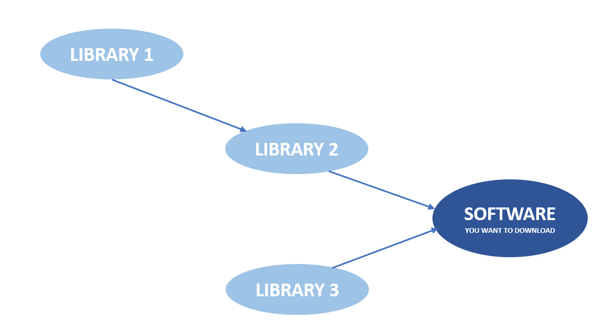

# Server Setup Week 2 (09/29/2021)
## RPM
rpm is a standard package manager software that profided by RedHat. If you want to use rpm to install software you need to install all of the library that it needs first. For example if your software need `library 2` and `library 3`, and `library 2` need `library 1`, then you need to install `library 1` first, then install `library 2` and `library 3`, and finaly install your software.

<br>

after you install the software it will add the software information into database, you can see the information by execute the following command `$ rpm -qa`.

In installing software you need to see whether the program compatible with your device. Take a look at the example below

```
joe-4.6-4.el7.x86_64.rpm
```
From the software description we know that:
* the filename is `Joe`
* version `4.6`
* `x86_64` means the file can be run in x86 with 64 bits CPU architecture
* `el7` means you can run the software in CentOS7

---

## Commands
### 1. uname

```
$ uname -a
```

will show your device operating system, sample output:

```
Linux nubletz 3.10.0-1160.25.1.el7.x86_64 #1 SMP Wed Apr 28 21:49:45 UTC 2021 x86_64 x86_64 x86_64 GNU/Linux
```

---

### 2. rpm
there are several rpm code that oftenly used such as:

`$ rpm -qa` : show list of all installed package

`$ rpm -qi {package}` :show installed information along with package version and short description

`$ rpm -ql {package}` : show the installed files that related to package

`$ rpm -qf {file_path}` : used to see the original file from

You can use the following command to download software into your device :

```
$ rpm -ivh
```

* `-i` : install
* `-v` : verbose
* `-h` : hash (will show the installation progress)

To upgrade a software simply use :

```
$ rpm -U
```
* `-U` : Upgrade


While to remove the software you can use :

```
$ rpm -e
```

---

### 3. nautilus

```
$ nautilus
```
used to open graphical file manager

---

### 4. eog (Eye of GNOM)

```
$ eog {filename}
```
used to see image file in LINUX