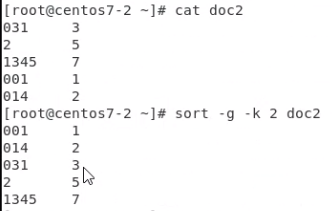

# Server Setup Week 3 (09/04/2021)
## SSH for Secure File Transfer
SSH (Secure Shell) is a protocol that use to connect to other server securely. From the previous notes we have known about [how to set up SSH passwordless login](https://github.com/NubletZ/LinuxOS_Notes/tree/nubletz/109%E4%B8%8B/Week-3#1-Set-up-SSH-passwordless-login) and [build SSH Tunel](https://github.com/NubletZ/LinuxOS_Notes/tree/nubletz/109%E4%B8%8B/Week-8#ssh-tunnel). In this chapter we will talk about how to transfer file securely using SSH. Before that we need to know that there are several type of encryption techniques in SSH to establish secure connections including : 

1. `symmetric encryption` an encryption where one key can be use to encrypt messages and decrypt the received messages from other participant.
2. `asymmetric encryption` have two associated keys known as private key and public key. In this encryption the datas are sent in a single direction, where public key encrypt the message and only private key is able to decrypt it.
3. `hashes` this encryption method will encrypt data and can't be reversed. With the same hashing function, each different data will have a unique hash, while the same data should have the same hash. Hashes are mainly used to verify whether the data that received is intact and unmodified.

To transfer file over SSH we can use scp (Secure Copy). This tool will read the data from the source folder and write it in the destionation folder. The general syntax fro scp is:

```
scp [OPTION] [user@][SRC_HOST:]Source_File [user@]
```

For example if we want to copy a.txt from local system to other server whith IP 192.168.1.2 in /tmp with root user credentials then we can type the following command:

```
$ scp a.txt root@192.168.1.2:/tmp
```

while to copy the file from remote server into current directory, type the following command:

```
$ scp root@192.168.1.2:/tmp/a.txt .
```

here "." represents the current working directory. We can also copy it to a specific path and change its name

```
$ scp root@192.168.1.2:/tmp/a.txt /user/path/change_name.txt
```

## Command
### 1. tr
tr is used for deleting or replacing character in string

`deleting character`

```
$ echo "string" | tr -d "[char to be deleted]"
```

`-d` : delete

example :

```
$ echo "abcd#AB?CD.1234" | tr -d "[:alnum:]"
> #?.
```

on the above example it will remove all the alpha and numeric characters.

`replacing character`

example :

```
$ echo "ABCD" | tr "[:upper:]" "[:lower:]"
> abcd

$ echo "ABCDabcd" | tr [:upper:] [:lower:]
> abcdabcd
```

from the above example it will replace all upper case character with the lower case character.

another example :

```
$ echo "ABCDabcd1234" | tr -c "0-9" "*"
> ********1234* (the last * is \n)
```

`-c` : complement

the complement option is used all of the character other than number (0-9) will be replaced with "*".

---

### 2. seq
seq (sequence) is used to generate the sequential number. Syntax :

```
seq [OPTION]... LAST
  or
seq [OPTION]... FIRST LAST
  or
seq [OPTION]... FIRST INCREMENT LAST
```

example :

```
$ seq 5 8
> 5
> 6
> 7
> 8

$ seq 8 -1 5
> 8
> 7
> 6
> 5
```

another example :

```
$ seq -w 1 2 11
> 01
> 03
> 05
> 07
> 09
> 11

$ seq -s "+" 1 10
> 1+2+3+4+5+6+7+8+9+10
```

`-w` : used to equalize width by padding with leading zeroes

`-s` : used to change the separate numbers. By default its value is "\n".

---

### 3. bc
bc have a function to calculate in Linux, you can use it together with seq like this :

```
$ seq -s "+" 1 10 | bc
> 55

$ echo "1.1+2.3*2" | bc
> 5.7
```

---

### 4. sort
A command that used to sort the file. Syntax :

```
$ sort filename
```

options :

`-r` : reverse the sort result

`-k` : set the sorting basis on which column number

`-g` : sort by the number value

example :

<br>

---

### 5. uniq
This command will remove the same character or string that is not separated by any character beside separator. Example :

```
//displaying contents of a.txt//
1
1
2
3
4
1
0
```

remove the duplicate character

```
$ uniq a.txt
1
2
3
4
1
0
```

---

### 6. cut
Used to get a substring from a string. Example :

```
$ echo 1234abc | cut -c 2-4
> 234
```

---

### 7. split
Used to split big file into smaller file

```
$ split -b 1m file3m
```

the above command will split 3m file into 3 1m files.