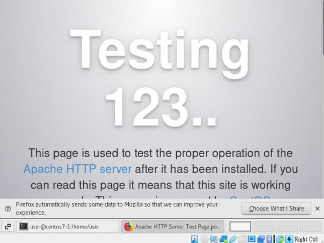
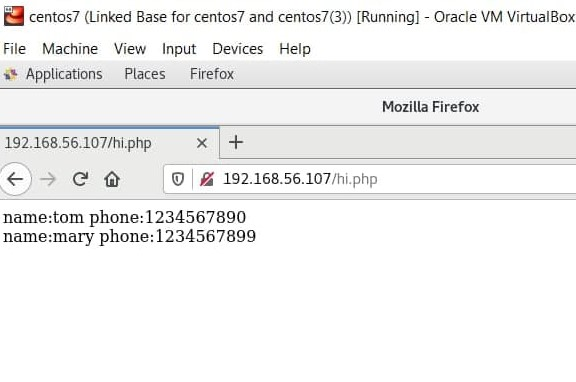

# Server Setup Week 5 (10/25/2021)
## Shell Script Conditional Statements
In Linux shell you also can execute a conditional statements and print the result using `echo $?` to see whether the execution was executed successfully or not. The output 0 means the condition statements is true while returning other number means the statements are incorrect.
You can write conditional statements by using a single `[` or double `[[`, there are some different on how to write the condition if you use `[` or `[[`.

1. in comparing two variable using `<` or `>`, if you use `[` you need to write it like this `\<` and `\>` while if you use `[[` you can write it as usual. See the example below :

```
[root@nubletz tmp]# num1=5
[root@nubletz tmp]# num2=6
[root@nubletz tmp]# [ $num1 \> $num2 ]
[root@nubletz tmp]# echo $?
1
[root@nubletz tmp]# [ $num1 > $num2 ]
[root@nubletz tmp]# echo $?
0
[root@nubletz tmp]# [[ $num1 > $num2 ]]
[root@nubletz tmp]# echo $?
1
```

2. If you want to use OR or AND statements, if you use `[` you can use `-a` for AND and `-o` for OR. While if you use `[[` you can use `||` for OR and `&&` for AND. See the example below :

```
[root@nubletz tmp]# [ 5 \> 6 -a 7 \< 8 ]
[root@nubletz tmp]# echo $?
1
[root@nubletz tmp]# [ 5 \> 6 -o 7 \< 8 ]
[root@nubletz tmp]# echo $?
0

see the sample for double bracket
[root@nubletz tmp]# [ 5 \> 6 -a 7 \< 8 ]
[root@nubletz tmp]# echo $?
1
[root@nubletz tmp]# [ 5 \> 6 -o 7 \< 8 ]
[root@nubletz tmp]# echo $?
0

[root@nubletz tmp]# [[ 5 > 6 || 7 < 8 ]]
[root@nubletz tmp]# echo $?
0
[root@nubletz tmp]# [[ 5 > 6 && 7 < 8 ]]
[root@nubletz tmp]# echo $?
1
```

## Using LAMP stack
LAMP stand for Linux operating system, Apache server, MySQL (MariaDB) database, and PHP programming language.

### Install Apache
First make sure that you packages have been updated by typing `sudo yum update`. After that install the Apache web server.

```
sudo yum install httpd
```

Type the following command to run Apache :

```
sudo systemctl start httpd.sevice
```

You can check whether the service is running by open the browser and type your public IP address. The browser shoud display the test web page :

<br>

### Install MariaDB
Next you need to install MariaDB to enable you create a database. To install MariaDB, type the following command :

```
sudo yum install mariadb-server mariadb
```

After that, start it by execute the following command :

```
sudo systemctl start mariadb
```

Since MariaDB doesn't have secure setting by default, so you need to configure it manualy. Type the following command to configure its settings :

```
sudo mysql_secure_installation
```

At first they will ask for the root password, just press `Enter` since you don't have any password yet.

Next it will ask you several questins like shown below :

```
Set root password? [y/n] Y
New password: (Enter your password here)
Re-enter new password: (Re-enter your password)

# Notes : the below question you can answer it by depending on what you need
Remove anonymous users? [y/n] Y
Disallow root login remotely? [y/n] Y
Remove test database and access to it? [y/n] Y
Reload privilege tables now? [y/n] Y
```

### Create a Simple Database
After you set up your root password for MariaDB, you can type the following command to enter MariaDB `mysql -uroot -p`, enter the password, and you can start to modify, create, or delete your data. To create a new database, simply type 

```
> create database databaseName;
```

And then show all of your database to check whether it's already created 

```
> show databases;
```

To start modify `databaseName` you can type :

```
> use databaseName;
```

Next to create table in  `databaseName` you can type :

```
> create table addrbook(name varchar(50) not null, phone varchar(10))
```

and insert some datas into it :

```
> insert into addrbook(name, phone) values ("tom", "1234567890")

> insert into addrbook(name, phone) values ("mary", "1234567899")
```

see whether your data has been inserted into `addrbook` table :

```
> select * from addrbook;
```

Now exit your MariaDB, next we will install and write a php code that later will be hosted by apache.

```
> exit
```

### Install PHP and Write Simple Code
to install php write command `sudo yum install php php-mysql`. Restart your Apache `sudo systemctl restart httpd` and then change your directory by typing `cd /var/www/html` the file in this directory will be hosted by apache. Write a new file, let's name it as `hi.php`. Edit `hi.php` and write the below code :

```
<?php
$servername="localhost";
$username="root";
$password="insert your password";
$dbname="databaseName";

$conn = new mysqli($servername, $username, $password, $dbname);

if ($conn->connect_error) {
    die("connection failed: ". $conn->connect_error);
}

$sql="select name,phone from addrbook";
$result=$conn->query($sql);

if($result->num_rows>0){
    while($row=$result->fetch_assoc()){
        echo "name:". $row["name"]. " phone:". $row["phone"]."<br>";
    }
}
?>
```

now check your browser by typing `publicIPaddress/hi.php` and you should see something like this

