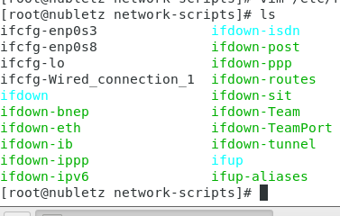

# Server Setup Week 7 (11/15/2021)
## How to Set Up NFS (Network File System)
For this tutorial, I'll be using 2 devices. The first device `192.168.56.107` as the `server` and another device as the `client`. Create directory in server I'll name it `mynfs`, later we will mount this directory in client device and place it in `mydata` directory. We need to install nfs in both device by using the following command:

```
sudo yum install nfs-utils
```

After that make sure that you have disabled getenforce and firewall in client server device. Edit `/etc/exports` file in server device and add this line:

```
/mynfs 192.168.56.0/24(rw,sync,no_root_squash,no_all_squash)
```

* rw : give client server permission to read and write in shared file directory
* sync : will confims requests to the shared directory only once the changes have been committed
* no_root_squash : will gives authority to root user on client device to access files on NFS server as root. Please keep in mind that this may lead to serious security implications.

start nfs-server in server device and start rpcbind in both device.

```
sudo systemctl start rpcbind
sudo systemctl start nfs-server
```

in client device type the following command to show and mount directory from server :

```
showmount -e 192.168.56.107
sudo mount -t nfs 192.168.56.107:/mynfs  /mydata
```

while to unmount it you can type `sudo umount /mydata`.

## Setting Up Network
There are 2 different ways to set up network, by using NetworkManager or network. In Linux you only able to use one settings at a time. NetworkManager will do the setting automatically while network will let you do the setting manualy. To change the setting from NetworkManager into network, first you need to stop NetworkManager and then start the network:

```
sudo systemctl stop NetworkManager
sudo systemctl disable NetworkManager
sudo systemctl start network
```
<br>

After that change the directory by typing `cd /etc/sysconfig/network-scripts` and then type command `ls`. You will see a file named as `ifcfg-[network name]` here I need to manualy se `ifcfg-enp0s3` and `ifcfg-enp0s8`. Because `ifcfg-enp0s3` is a Host-OnlyAdapter so I set it like this :

```
TYPE=Ethernet
BOOTPROTO=static
NAME=enp0s3
DEVICE=enp0s3
ONBOOT=yes
IPADDR=192.168.56.107
NETMASK=255.255.255.0
```

After that add the new IP address into enp0s3 manualy by execute command `ip addr add 192.168.56.107/24 brd + dev enp0s3`.

While for `ifcfg-enp0s8` because it's a NAT network, so I set it like this :

```
TYPE=Ethernet
BOOTPROTO=static
NAME=enp0s8
DEVICE=enp0s8
ONBOOT=yes
IPADDR=10.0.3.15
NETMASK=255.255.255.0
GATEWAY=10.0.3.2
```

Now you should be able to ping 8.8.8.8. While to enable ping into other some website like Google, etc you need to  `vim /etc/resolv.conf` and add nameserver into it :

```
; generated by /usr/sbin/dhclient-script
nameserver 8.8.8.8
```

## COMMAND
### 1. exportfs
This command will make local directories available for NFS clients to mount. Example:

```
$ exportfs -a
```

> The above command will export all directories in /etc/exports.

```
$ exportfs /mynfs
```

> The above code will export one directory from /mynfs file.
