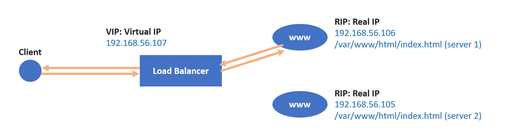
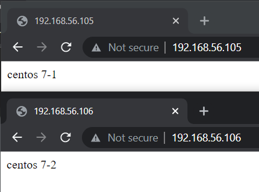

# Server Setup Week 9 (11/29/2021)
## Load Balancer
Load balancer is a set of components that provide for balancing IP traffic across a set of real server. It can be differentiate into :
1. Hardware base = F5
2. Software base = LVS, HAPROXY

If a client ask to connect into server, it wouldn't connect directly, it will connected to load balancer's VIP (Virtual IP) and load balancer will process the request by using RR (Round Robin), WRR (Waiting Round Robin), LC (Least Connections), or WLC (Weighted Least Connections) to connect it to server. 

Load balancing can be performed in `layer 4` and `layer 7`.
1. In `layer 4` when client want to send request, it will request to port 80 and load balancer will dispatch the request to different server.
2. In `layer 7` when client send request it then makes a new TCP connection to the selected upstream server and writes the request to the server.

## Set up HAProxy 
First we need to prepare 3 device virtual machine, for example `192.168.56.107` as a device where we will set up HAProxy, `192.168.56.105` and `192.168.56.106` as server. 

<br>

First we need to make sure that http is running in both server by execute command `sudo systemctl start httpd` and make sure that all device's security was disabled, check it by type `getenforce`.

After that execute this several command in server 1 `192.168.56.105` to make a simple webpage that contain the server name :

```
# cd /var/www/html
# echo "centos 7-1" > index.html
```

do the similar things in server 2 `192.168.56.106` but write "centos 7-2" in index.html :

```
# cd /var/www/html
# echo "centos 7-2" > index.html
```

if you have do the step correctly you should see centos 7-1 in your browser if you type `192.168.56.105` and centos 7-2 in `192.168.56.106` like shown below.

<br>

Now in device `192.168.56.107` to set up HAProxy you need to install this several things

```
sudo yum install -y epel-release
sudo yum install haproxy -y
```

After the installations have been finished, we need to make some change in HAProxy configuration. You can back up the default configuration by execute the following command :

```
cp /etc/haproxy/haproxy.cfg /etc/haproxy/haproxy.cfg.bak
```

the backup file is the one that end with *.bak.

After that change the haproxy.cfg content by using command `vi /etc/haproxy/haproxy.cfg`. Write the following text into it :

```
global
  daemon
  chroot /var/lib/haproxy
  user haproxy
  group haproxy
  stats timeout 30s

defaults
  mode http
  log global
  option httplog
  option dontlognull
  timeout connect 5000
  timeout client 50000
  timeout server 50000

frontend http_front
  bind *:80
  stats uri /haproxy?stats
  default_backend http_back

backend http_back
  balance roundrobin
  server server_name1 192.168.153.151:80 check
  server server_name2 192.168.153.152:80 check
```

After that restart the haproxy `sudo systemctl restart haproxy` and make sure if haproxy already run. If you've successfully done the above steps then in your browser if you go to `192.168.56.107` you will see `centos 7-1` and `centos 7-2` keep changing whenever you refresh the page.

<br>